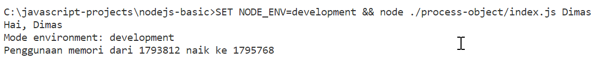
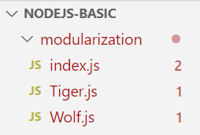
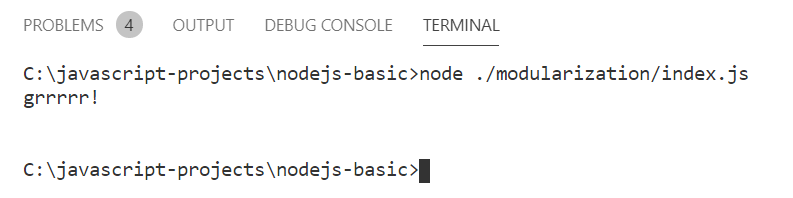
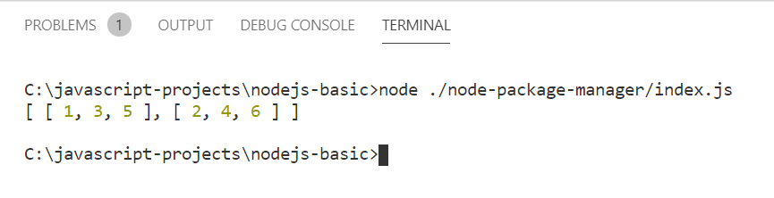
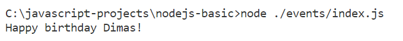
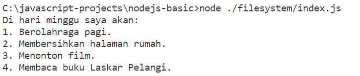

# Apa itu Node.js

Pada tahun 2009, Ryan Dahl membuat Node.js dan Node.js berhasil menjadi JavaScript Runtime yang dapat mengeksekusi kode JavaScript di luar browser.

# Latihan: Membuat Proyek Node.js

Langkah-langkah untuk emmbuat proyek Node.js

1. Membuat folder proyek
2. Buka folder proyek yang sudah dibuat
3. Untuk membuat proyek JavaScript baru, jalankan perintah `npm init`
   > NPM alias Node Package Manager merupakan JavaScript Package Manager bawaan dari Node.js. Melalui NPM ini kita dapat membuat Node.js package (proyek) dan mengelola penggunaan package eksternal yang digunakan. Kita akan membahas NPM lebih detail nanti.
4. Setelah menuliskan perintah di atas, Anda akan diberikan beberapa pertanyaan untuk mengisi nilai package name, version, description. Nilai yang berada di dalam tanda kurung merupakan nilai default. Anda dapat menggunakan nilainya dengan langsung menekan tombol Enter. **Untuk saat ini, cukup berikan semua pertanyaan dengan nilai default.**
5. Setelah selesai, Anda akan mendapatkan file [`package.json`](nodejs-basic/package.json) yang berisi informasi proyek Node.js yang sudah dibuat.

---

# Latihan: Menjalankan Javascript Menggunakan Node.js

Ada dua cara untuk menjalankan kode JavaScript menggunakan Node.js. Yang pertama dengan NodeREPL dan yang kedua dengan mengeksekusi file JavaScript.

## The Node.js REPL

Node.js memiliki REPL atau **R**ead-**E**val-**P**rint-**L**oop. Fitur ini berguna untuk membaca kode JS, mengevaluasi kode, kemudia mencetak hasil evaluasinya ke console, dan Loop artinya proses tersebut berulang.

1. Untuk mengaksesnya gunakan perinta **node** pada terminal.
2. Sekarang, kita sudah bisa menuliskan kode JS dan Mengekskusi kode JS di dalam NodeREPL. Contohnya:

```javascript
> console.log('Hello, World!');
// Output: Hello World
```

Maka akan muncul output `Hello, World!` dan nilai `undefined` karena fungsi `console.log()` tidak mengembalikan nilai. 3. Untuk membuktikan apakah undefined dihasilkan karena tidak ada nilai yang dikembalikan oleh fungsi `console.log()`, kita bisa menuliskan kode berikut:

```javascript
> 2 + 2
// Output: 4
```

Maka akan muncul output `4` dan nilai `4` karena operasi penjumlahan `2 + 2` mengembalikan nilai `4`.

Dan selanjutnya kita akan menggunakan mode editor untuk menulis kode JS lebih dari satu baris.

4. Untuk masuk ke mode editor gunakan perintah `.editor` pada NodeREPL. Untuk mengeksekusi kode yang sudah ditulis, gunakan tombol `Ctrl + D` pada keyboard. Dan untuk keluar dari mode editor, gunakan tombol `Ctrl + C` pada keyboard.
   Contoh kode yang akan kita tulis:

```javascript
> .editor
// Entering editor mode (^D to finish, ^C to cancel)
const welcome = (name) => {
  return `Welcome ${name}`;
}

Welcome('Node REPL'); // CTRL + D dibagian ini
// Output: 'Welcome Node REPL'
```

Nilai variabel `welcome` akan tersimpan di dalam memori NodeREPL dan bisa digunakan kembali selama NodeREPL masih berjalan. Jika NodeREPL dimatikan dengan `.exit`, maka nilai variabel `welcome` akan hilang.

## Running Javascript Files

Cara lain mengeksekusi kode JS adalah dengan mengeksekusi file JS. Berikut langkah-langkahnya:

1. Buat file JS baru, misalnya [`index.js`](nodejs-basic/index.js).
2. Tulis kode JS di dalam file tersebut, misalnya:

```javascript
const message = (name) => {
  console.log(`Hello ${name}`);
};

message("JavaScript"); // CTRL + D dibagian ini
// Output: Hello JavaScript
```

3. Untuk mengeksekusi file JS, gunakan perintah `node nama_file.js`, misalnya:

```bash
node index.js
```

Maka akan muncul output `Hello JavaScript`.

---

# Node.js Global Project

Objek window pada browser dan objek global pada Node.js merupakan Global Object. Seluruh fungsi atau properti yang menjadi member dari global object dapat diakses di mana saja alias memiliki cakupan global. Untuk mengetahui fungsi atau properti apa saja yang dimiliki oleh global object, Anda bisa mengetikkan `global` pada NodeREPL.

```javascript
> Object.getOwnPropertyNames(global);
```

Objek yang bernama 'true globals' diantaranya:

- `global`: Global namespace. Member apa pun dalam global namespace dapat diakses di mana saja.
- `process`: Objek proses yang berjalan.
- `console`: Fungsionalitas STDIO.
- `setTimeout`, `clearTimeout`, `setInterval`, `clearInterval`: Fungsi untuk mengatur waktu.

Ada juga objek yang disebut 'pseudo-globals' yang merupakan objek yang sebenarnya bukan global, tetapi dapat diakses di mana saja. Objek tersebut diantaranya:

- `module`: Digunakan untuk mengakses informasi tentang modul saat ini.
- `__filename`: Nama file yang sedang dieksekusi.
- `__dirname`: Direktori dari file yang sedang dieksekusi.
- `require`: Digunakan untuk mengimpor modul.

---

# Process Object

Pada Node.js, global objek process memiliki fungsi dan properti yang dapat memberikan informasi mengenai proses yang sedang berjalan.

Yang sering digunakan salah satunya adalah `process.env`. Properti ini berisi informasi mengenai environment yang sedang berjalan. Anda bisa mengetahui informasi seperti direktori, nama host, dan lain sebagainya. [Daftar lengkap properti process.env](https://nodejs.org/dist/latest-v8.x/docs/api/process.html#process_process_env).

Kita juga bisa menyimpan nilai di dalam `process.env` biasanya berguna untuk menentukan alur code seperti if-else di program berdasarkan environment yang sedang berjalan. Contohnya, ketika Anda ingin mengatur environment development dan production.

```javascript
const http = require("http");
const hostname = process.env.NODE_ENV !== "production" ? "localhost" : "dicoding.com";
const port = 3000;
const requestHandler = (req, res) => {
  res.statusCode = 200;
  res.setHeader("Content-Type", "text/plain");
  res.end("Hello, World!\n");
};
const server = http.createServer(requestHandler);
server.listen(port, hostname, () => {
  console.log(`Server berjalan pada http://${hostname}:${port}/`);
});
```

Cara memberikan nilai di `process.env` adalah dengan memberikannya saat mengeksekusi berkas JS. Jika Linux dan MacOS maka gunakan perintah `NODE_ENV=production node index.js`, sedangkan di Windows gunakan perintah `set NODE_ENV=production && node index.js`.

Nilai ini hanya bisa diakses di proses Node.js. Kita tidak bisa mengaksesnya di program lain atau di luar Node.js.

Objek `process` juga punya fungsi lain, seperti mendapatkan informasi tentang penggunaan memory ketika proses berjalan dengan `process.memoryUsage()`.

```javascript
const memoryInformation = process.memoryUsage();

console.log(memoryInformation);

/* output
{
  rss: 14569472,
  heapTotal: 2654208,
  heapUsed: 1788896,
  external: 855681,
  arrayBuffers: 9898
}
*/
```

Dan yang penting lainnya yaitu properti `process.argv`. Properti ini dapat menampung nilai baris perintah dalam bentuk array. Contohnya jika kita menjalankan kode `node app.js "harry" "potter"`, maka `process.argv` akan berisi:

- `process.argv[0]`: alamat path dari Node.js
- `process.argv[1]`: alamat path dari berkas yang dieksekusi
- `process.argv[2]`: "harry"
- `process.argv[3]`: "potter"

```javascript
const firstName = process.argv[2];
const lastName = process.argv[3];

console.log(`Hello ${firstName} ${lastName}`);
// Output: Hello harry potter
```

[Dokumentasi lengkap process object](https://nodejs.org/api/process.html)

## Tantangan: Process Object

Untuk tantangan kali ini, buatlah berkas index.js baru di dalam folder baru process-object pada proyek nodejs-basic.

Kemudian tulislah kode berikut:

```javascript
const initialMemoryUsage = // TODO 1
const yourName = // TODO 2
const environment = // TODO 3

for(let i = 0; i <= 10000; i++) {
// Proses looping ini akan membuat penggunaan memori naik
}

const currentMemoryUsage = // TODO 4

console.log(`Hai, ${yourName}`);
console.log(`Mode environment: ${environment}`)
console.log(`Penggunaan memori dari ${initialMemoryUsage} naik ke ${currentMemoryUsage}`);
```

Selesaikan kode yang ditandai TODO dengan ketentuan berikut:

TODO 1 : Isi dengan nilai `heapUsed` dari instance `process.memoryUsage`.
TODO 2 : Isi dengan nilai index ke-2 dari `process.argv`.
TODO 3 : Isi dengan nilai `NODE_ENV` dari `process.env`.
TODO 4 : Isi dengan nilai `heapUsed` dari instance `process.memoryUsage`.
Setelah mengerjakan seluruh TODO, eksekusi berkas JavaScript dengan perintah:

> SET NODE_ENV=development && node ./process-object/index.js `<Nama Anda> `

Ganti `<Nama Anda>` dengan nama depan Anda. Bila TODO berhasil dikerjakan dengan baik, maka console akan menghasilkan output:



Jawaban:

```javascript
const initialMemoryUsage = process.memoryUsage().heapUsed;
const yourName = process.argv[2];
const environment = process.env.NODE_ENV;
for (let i = 0; i <= 10000; i++) {
  // Proses looping ini akan membuat penggunaan memori naik
}

const currentMemoryUsage = process.memoryUsage().heapUsed;

console.log(`Hai, ${yourName}`);
console.log(`Mode environment: ${environment}`);
console.log(`Penggunaan memori dari ${initialMemoryUsage} naik ke ${currentMemoryUsage}`);
```

---

# Modularization

Jika kode dituliskan dalam satu berkas saja, maka akan sangat sulit untuk membaca serta memelihara kode tersebut. **Idealnya, satu berkas JavaScript hanya memiliki satu tanggung jawab saja.**

Anda bisa membagikan nilai variabel, objek, class, atau apa pun itu antar modul. Untuk melakukannya, Anda perlu mengekspor nilai pada module tersebut.

Untuk mengekspornya, simpanlah nilai tersebut pada properti `module.exports`. Contoh seperti ini:

```javascript Coffee.js
const coffee = {
  name: "Tubruk",
  price: 15000,
};

module.exports = coffee;
```

Setelah itu nilai `coffee`dapat digunakan pada berkas JavaScript lain dengan cara mengimpor nilainya melalui fungsi global `require()`. Contoh:

```javascript App.js
const coffee = require("./coffee");

console.log(coffee);

/**
 * node app.js
 *
 * output:
 * { name: 'Tubruk', price: 15000 }
 */
```

Ingat! Jika Anda hendak mengimpor modul lokal (local module), selalu gunakan tanda `./` di awal alamatnya ya.

Bila berkas coffee.js diletakkan di folder yang berbeda dengan app.js, contohnya memiliki struktur seperti ini:

`root folder:` <br/>
`├── app.js` <br/>
`├── package.json` <br/>
`└── lib` <br/>
&nbsp;&nbsp;&nbsp;&nbsp;&nbsp;&nbsp;`└── coffee.js`

Maka kita perlu mengimpornya dengan alamat yang sesuai:

```javascript App.js
const coffee = require("./lib/coffee");
```

Kita juga bisa menggunakan `../` untuk mengakses folder di atasnya atau kelar dari satu level folder.

```javascript App.js
const coffee = require("../lib/coffee");
```

Dalam impor dan ekspor nilai kita bisa menggunakan object literal dan object destructuring untuk mengimpor lebih dari satu nilai. Contohnya seperti ini:

```javascript user.js
const firstName = "Harry";
const lastName = "Potter";

/* gunakan object literal
untuk mengekspor lebih dari satu nilai. */
module.exports = { firstName, lastName };
```

```javascript app.js
/**
 * Gunakan object destructuring untuk mengimpor lebih dari satu nilai pada modul.
 */
const { firstName, lastName } = require("./user");

console.log(firstName);
console.log(lastName);

/**
 * output:
 * Harry
 * Potter
 */
```

Ada 3 jenis modul di Node.js:

- **local module**: modul yang kita buat sendiri.
- **core module**: modul bawaan Node.js yang ada di folder lib yang terpasang di komputer dan bisa digunakan dimanapun.
- **third-party module**: modul yang dibuat oleh pihak ketiga dan dipasang dengan Node Package Manager. Dan akan disimpan di folder node_modules.

## Latihan: Modularization

Buat folder baru dengan nama modularization pada proyek nodejs-basic dan di dalamnya buat tiga berkas JavaScript baru yakni Tiger.js, Wolf.js, dan index.js.



Kemudian tulislah kode berikut:

```javascript Tiger.js
class Tiger {
  constructor() {
    this.strength = Math.floor(Math.random() * 100);
  }

  growl() {
    console.log("grrrrr!");
  }
}

// TODO 1
```

```javascript Wolf.jsclass Wolf {
  constructor() {
    this.strength = Math.floor(Math.random() * 100);
  }

  howl() {
    console.log('owooooo!')
  }
}

// TODO 2
```

```javascript index.js
const Tiger = // TODO 3
const Wolf = // TODO 4

const fighting = (tiger, wolf) => {
  if(tiger.strength > wolf.strength) {
    tiger.growl();
    return;
  }

  if(wolf.strength > tiger.strength) {
    wolf.howl();
    return;
  }

  console.log('Tiger and Wolf have same strength');
}

const tiger = new Tiger();
const wolf = new Wolf();

fighting(tiger, wolf);
```

Selesaikan kode yang ditandai TODO dengan ketentuan berikut:

- **TODO 1** : Ekspor class Tiger agar dapat digunakan pada berkas JavaScript lain.
- **TODO 2** : Ekspor class Wolf agar dapat digunakan pada berkas JavaScript lain.
- **TODO 3** : Import class Tiger dari berkas Tiger.js.
- **TODO 4** : Import class Wolf dari berkas Wolf.js.

Setelah selesai mengerjakan TODO, eksekusi berkas index.js dengan perintah:

```
node ./modularization/index.js
```

Dan outpunya akan seperti ini:


---

# Node Package Manager (NPM)

NPM bisa memasang atau menghapus third party modul. Modul yang dipasang ada di node_modules.

Hindari pemasangan modul secara global karena akan menyebabkan banyak masalah. Sebaiknya gunakan npx bila Anda ingin menjalankan Node.js package di mana pun Anda inginkan.

Contohnya memasang MomentJS dengan

```bash
npm install moment
```

Dan kita bisa module moment di project kita dengan

```javascript
const moment = require("moment");

const date = moment().format("MMM Do YY");
console.log(date);

/**
 * output:
 * Tanggal hari ini dalam format: Sep 22nd 21
 */
```

Dan module yang dipasang bisa dilihat di package.json bagian `dependencies`. Dan bisa dihapus dengan perintah `npm uninstall nama_modul`. NPM juga bisa menjalankan script dengan perintah `npm run nama_script`, biasanya untuk menjelankan node.js process seperti environment development atau production.

```json
"scripts": {
  "start-dev": "SET NODE_ENV=development && node app.js", // tergantung OS yang digunakan
  "start": "SET NODE_ENV=production && node app.js",
}
```

## Latihan: Node Package Manager (NPM)

Latihan ini akan memasang module lodash dan di file index.js tulis kode berikut:

```javascript
const _ = // TODO

const myOddEvenArray = _.partition([1, 2, 3, 4, 5, 6], (n) => n % 2);

console.log(myOddEvenArray);
```

Tugasnya:

- Pasang package lodash pada proyek nodejs-basic.
- Gunakan package lodash pada TODO sehingga index.js dapat dieksekusi dengan baik.

Bila Anda telah mengerjakan semuanya dengan benar, eksekusi berkas **index.js** dengan perintah:

```bash
node ./node-package-manager/index.js
```

Dan outputnya akan seperti ini:


---

# Events

Node.js biasanya punya pola event-driven atau alur berdasarkan suatu kejadian. Node.js menggunakan EventEmitter untuk mengimplementasikan pola ini.

```javascript
const EventEmitter = require("events");

const myEventEmitter = new EventEmitter();
```

Setiap instance dari EventEmiiter punya fungsi on, dan kita bisa menentukan aksi dari kejadian.

```javascript
const { EventEmitter } = require {'events'};

const myEventEmitter = new EventEmitter();

// fungsi yang akan dijalankan ketika event coffee-order terjadi
const makeCoffee = ({ name }) => {
    console.log(`Kopi ${name} telah dibuat!`);
};

// mendaftarkan fungsi makeCoffee sebagai listener event coffee-order
myEventEmitter.on('coffee-order', makeCoffee);
```

Fungsi on menerima dua argumen yang pertama nama event nya dan kedua adalah fungsi yang akan dijalankan ketika event terjadi atau disebut listener. Dari kode diatas berarti ketika event coffee-order terjadi maka fungsi `makeCoffee` akan dijalankan.

> Nama event biasanya bebas. Namun, sebaiknya gunakan nama yang jelas dan mudah dipahami. Dan sebaiknya gunakan (-) untuk memisahkan kata.

Untuk memanggil event gunakan fungsi `emit()`.

```javascript
const { EventEmitter } = require("events");

const myEventEmitter = new EventEmitter();

const makeCoffee = ({ name }) => {
  console.log(`Kopi ${name} telah dibuat!`);
};

myEventEmitter.on("coffee-order", makeCoffee);

// Memicu event 'coffee-order' terjadi.
myEventEmitter.emit("coffee-order", { name: "Tubruk" });
```

Emit() bisa menerima argumen kedua, ketiga, dan seterusnya yang akan diteruskan ke listener. Yang dimana argumen pertama adalah nama event.

Listener juga bisa didaftarkan lebih dari satu.

```javascript
const { EventEmitter } = require("events");

const myEventEmitter = new EventEmitter();

const makeCoffee = ({ name }) => {
  console.log(`Kopi ${name} telah dibuat!`);
};

const makeBill = ({ price }) => {
  console.log(`Bill sebesar ${price} telah dibuat!`);
};

myEventEmitter.on("coffee-order", makeCoffee);
myEventEmitter.on("coffee-order", makeBill);

myEventEmitter.emit("coffee-order", { name: "Tubruk", price: 15000 });

/**
 * output:
 * Kopi Tubruk telah dibuat!
 * Bill sebesar 15000 telah dibuat!
 */
```

Atau bisa juga menggunakan fungsi khusus untuk menangani event yang biasa disebut 'handler' atau 'listener'.

```javascript
const { EventEmitter } = require("events");

const myEventEmitter = new EventEmitter();

const makeCoffee = (name) => {
  console.log(`Kopi ${name} telah dibuat!`);
};

const makeBill = (price) => {
  console.log(`Bill sebesar ${price} telah dibuat!`);
};

const onCoffeeOrderedListener = ({ name, price }) => {
  makeCoffee(name);
  makeBill(price);
};

myEventEmitter.on("coffee-order", onCoffeeOrderedListener);

myEventEmitter.emit("coffee-order", { name: "Tubruk", price: 15000 });

/**
 * output:
 * Kopi Tubruk telah dibuat!
 * Bill sebesar 15000 telah dibuat!
 */
```

## Latihan: Events

Buat folder baru bernama `events` dan didalamnya buat file index.js

Tulis Starter Code berikut:

```javascript
// TODO 1

const birthdayEventListener = (name) => {
  console.log(`Happy birthday ${name}!`);
};

// TODO 2

// TODO 3

// TODO 4
```

Tugasnya:

- **TODO 1** : Buat atau impor variabel `EventEmitter` dari core module `events`.
- **TODO 2** : Buat variabel `myEmitter` yang merupakan instance dari `EventEmitter`.
- **TODO 3** : Tentukan `birthdayEventListener` sebagai aksi ketika event ‘birthday’ dibangkitkan pada `myEmitter`.
- **TODO 4** : Bangkitkanlah event ‘birthday’ pada myEmitter dengan method `emit()` dan beri nilai argumen listener dengan nama Anda.

Bila Anda selesai mengerjakan TODO yang ada, eksekusi berkas index.js dengan perintah:

```bash
node ./events/index.js
```

Dan outputnya akan seperti ini:


Jawaban:

```javascript
// TODO 1
const { EventEmitter } = require("events");

const birthdayEventListener = (name) => {
  console.log(`Happy birthday ${name}!`);
};

// TODO 2
const myEmitter = new EventEmitter();

// TODO 3
myEmitter.on("birthday", birthdayEventListener);

// TODO 4
myEmitter.emit("birthday", "Suken");
```

---

# Filesystem

Sandboxing melindungi kita dari program jahat serta tindakan pencurian yang dapat merampas privasi penggunanya.

Node.js menyediakan core modules fs yang dapat mempermudah kita dalam mengakses filesystem. Setiap method yang ada di module fs tersedia dalam dua versi, yakni versi asynchronous (default) dan versi synchronous.

Untuk mengakses file akan menggunakan `fs.readFile()` dengan menerima tiga arguman taitu lokasi file, encoding, dan callback.

```javascript
const fs = require("fs");

const fileReadCallback = (error, data) => {
  if (error) {
    console.log("Gagal membaca berkas");
    return;
  }
  console.log(data);
};

fs.readFile("todo.txt", "UTF-8", fileReadCallback);
```

Kita juga bisa menggunakan method versih synchronous dengan menambahkan `Sync` di belakang methodnya. `fs.readFileSync().`

```javascript
const fs = require("fs");

const data = fs.readFileSync("todo.txt", "UTF-8");
console.log(data);
```

## Latihan: Filesystem

Buat folder baru dengan nama filesystem dan di dalamnya buat file index.js dan notes.txt.

Tulis Starter Code berikut:

```javascript notes.txt
Di hari minggu saya akan:
1. Berolahraga pagi.
2. Membersihkan halaman rumah.
3. Menonton film.
4. Membaca buku Laskar Pelangi.
```

```javascript index.js
// TODO: tampilkan teks pada notes.txt pada console.
```

Tugasnya yaitu menampilkan teks pada notes.txt pada console menggunakan filesystem.

Bila Anda telah mengerjakan semuanya dengan benar, eksekusi berkas index.js dengan perintah:

```bash
node ./filesystem/index.js
```

Jika berhasil, maka outputnya akan seperti ini:


**Tips**: Bisa gunakan method

```javascript
path.resolve(__dirname, "notes.txt");
```

Jawaban:

```javascript
const fs = require("fs");
const path = require("node:path");

const data = fs.readFileSync(path.resolve(__dirname, "notes.txt"), "UTF-8");
console.log(data);
```

---

# Readable Stream

Jika kita ingin membaca file yang besar, kita bisa menggunakan Readable Stream. Readable Stream akan membaca file secara perlahan-lahan dan tidak membebani memori. Dan cara memakainya adalah dengan menggunakan method `fs.createReadStream()`.

```javascript
const fs = require("fs");

const readableStream = fs.createReadStream("./article.txt", {
  highWaterMark: 10,
});

readableStream.on("readable", () => {
  try {
    process.stdout.write(`[${readableStream.read()}]`);
  } catch (error) {
    // catch the error when the chunk cannot be read.
  }
});

readableStream.on("end", () => {
  console.log("Done");
});
```

Fungsi `fs.createReadStream()` menerima dua argumen, yang pertama adalah lokasi file yang akan dibaca dan yang kedua adalah opsi konfigurasi. Opsi konfigurasi ini bisa berupa `highWaterMark` yang merupakan batas maksimum buffer yang akan dibaca dengan nilai default 16384 bytes (16kb).

> Buffer di dalam stream adalah memori sementara yang digunakan oleh stream dalam menyimpan data hingga data tersebut dikonsumsi.

`createReadStream()` akan mengembalikan `EventEmitter`, yang berguna untuk lister setiap event readable dan end. readable akan aktif ketika buffer sudah memiliki ukuran sesuai dengan nilai yang ditetapkan pada properti `highWatermark`, dan end akan aktif ketika proses pembacaan file selesai.

Buatlah file `article.txt` dengan isi:

```text
Stream di Node.js

Teknik stream merupakan salah satu konsep fundamental yang mendukung aplikasi Node.js bekerja. Teknik ini dapat menangani kasus baca tulis berkas, komunikasi jaringan, atau beban kerja apapun agar dapat berjalan dengan lebih efisien.
```

Outputnya akan seperti ini:

```bash
[Stream di ][Node.js

][Teknik str][eam merupa][kan salah ][satu konse][p fundamen][tal yang m][endukung a][plikasi No][deJS beker][ja. Teknik][ ini dapat][ menangani][ kasus bac][a tulis be][rkas, komu][nikasi jar][ingan, ata][u beban ke][rja apapun][ agar dapa][t berjalan][ dengan le][bih efisie][n.][null]Done
```

---

# Writable Stream

Untuk menggunakan Writable Stream, kita bisa menggunakan method `fs.createWriteStream()`.

```javascript
const fs = require("fs");

const writableStream = fs.createWriteStream("output.txt");
```

Fungsi ini menerima argumen yaitu alamat file untuk menyimpan data nya, jika tidak ada file maka akan otomatis dibuat, tapi jika sudah ada maka akan menimpa isi file.

Gunakan `write()` untuk menulis data di writeable stream

```javascript
const fs = require("fs");

const writableStream = fs.createWriteStream("output.txt");

writableStream.write("Ini merupakan teks baris pertama!\n");
writableStream.write("Ini merupakan teks baris kedua!\n");
writableStream.end("Akhir dari writeable stream!"); // end digunakan untuk tanda akhir dari stream
```

Outputnya akan seperti ini:

```bash
Ini merupakan teks baris pertama!
Ini merupakan teks baris kedua!
Akhir dari writable stream!
```

## Latihan: Stream

Buat folder baru dengan nama stream dan di dalamnya buat file index.js dan input.txt.

Dan buat starter code berikut:

```javascript input.txt
Lorem ipsum dolor sit amet, consectetur adipiscing elit, sed do eiusmod tempor incididunt ut labore et dolore magna aliqua. Ut enim ad minim veniam, quis nostrud exercitation ullamco laboris nisi ut aliquip ex ea commodo consequat. Duis aute irure dolor in reprehenderit in voluptate velit esse cillum dolore eu fugiat nulla pariatur. Excepteur sint occaecat cupidatat non proident, sunt in culpa qui officia deserunt mollit anim id est laborum.
```

```javascript index.js
/**
 * TODO:
 * Buatlah program untuk membaca teks input.txt dan menuliskannya ulang pada berkas output.txt
 * menggunakan teknik readable stream dan writable stream.
 */
```

Tugasnya yaitu membuat program baca dan tulis ulang teks dari stream dengan ketentuan:

- Teks yang dibaca oleh readable stream berukuran 15 karakter tiap bagiannya. Tentukan nilai highWaterMark pada readable stream.
- Tulis ulang teks dengan menggunakan teknik writeable stream di output.txt. Untuk tiap baris baru pisahkan dengan ('\n')

Solusi:

```javascript
/**
 * TODO:
 * Buatlah program untuk membaca teks input.txt dan menuliskannya ulang pada berkas output.txt
 * menggunakan teknik readable stream dan writable stream.
 */

const fs = require("fs");

const readableStream = fs.createReadStream("input.txt", { highWaterMark: 15 });

const writeableStream = fs.createWriteStream("output.txt");

readableStream.on("readable", () => {
  try {
    writeableStream.write(`${readableStream.read()}\n`);
  } catch (error) {
    console.log("Bang error!");
  }
});

readableStream.on("end", () => {
  writeableStream.end("Akhir dari writeable"); // end digunakan untuk tanda akhir dari stream, dan ketika end dijalankan maka stream akan ditutup dan tidak bisa ditulis lagi. end juga bisa berada di dalam event readable.
  console.log("Done");
});m
```

Bisa juga menggunakan path.resolve untuk menentukan path file.

```javascript
const readableStream = fs.createReadStream(path.resolve(__dirname, "input.txt"), { highWaterMark: 15 });

const writeableStream = fs.createWriteStream(path.resolve(__dirname, "output.txt"));
```

[Video Dasar Dasar Node.js](https://youtu.be/_qN02jvqvLo)
