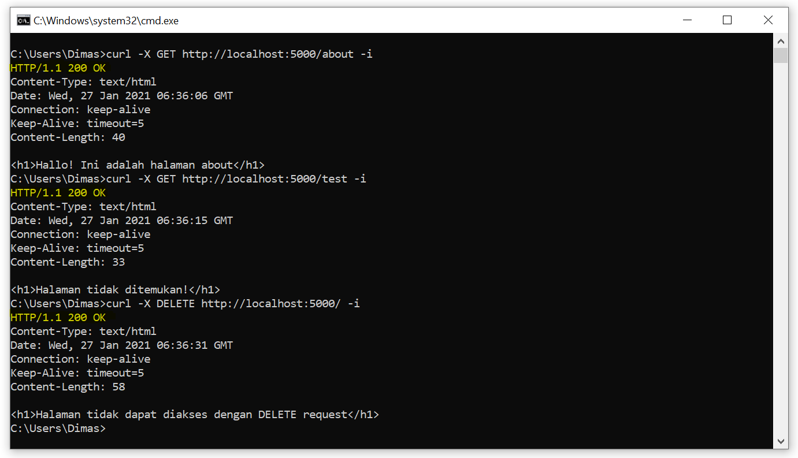
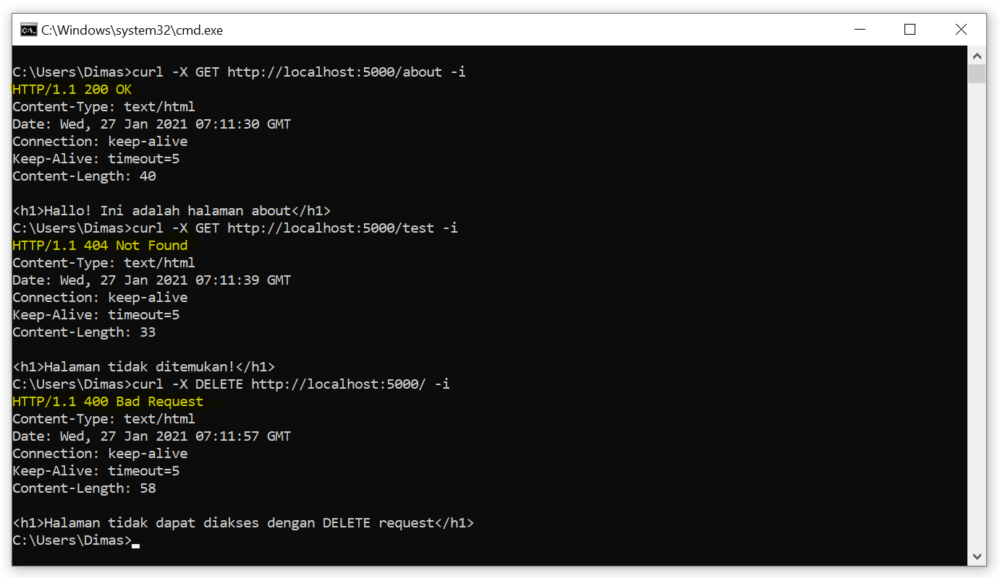
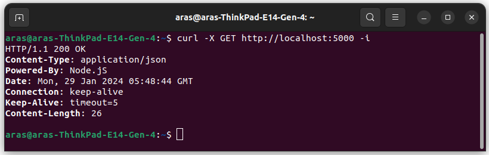
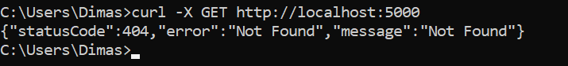
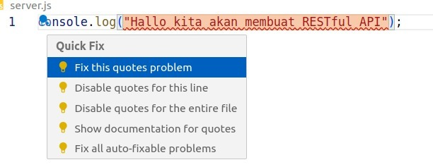

# Latihan: Membangun Web Server dengan Node.js secara Native

1. Silakan buat folder baru di dalam **C -> javascript-projects (Windows) atau home -> javascript-project (Linux dan Mac)** dengan nama “nodejs-web-server”.
2. Setelah itu, buka folder tersebut menggunakan VSCode.
3. Buka Terminal dan tulis perintah `npm init -y` untuk membuat file `package.json`.
4. Pastikan ada file `package.json` di dalam folder tersebut.
5. Lanjut dengan membuat file `server.js` di dalam folder tersebut.
6. Di dalamnya tulisakan kode JS berikut:

```javascript
console.log("Halo, kita akan belajar membuat server");
```

7. Kemudian buka **package.json** dan buat runner script dengan nama `start` yang berisi `node server.js`. Runner script test bisa dihapus saja.
8. Save dan jalankan dengan `npm run start`.

---

# Membuat HTTP Server

Node.js menyediakan core modules http untuk web server. `const http = require('http');`. Salah satu method pentingnya yaitu `http.createServer()`. Method ini menerima parameter berupa callback function yang akan dijalankan ketika server dijalankan. Callback function tersebut menerima dua parameter yaitu `request` dan `response`.

```javascript
const http = require("http");

/**
 * Logika untuk menangani dan menanggapi request dituliskan pada fungsi ini
 *
 * @param request: objek yang berisikan informasi terkait permintaan
 * @param response: objek yang digunakan untuk menanggapi permintaan
 */
const requestListener = (request, response) => {};

const server = http.createServer(requestListener);
```

Parameter `request` akan berisi informasi terkait permintaan yang dikirimkan oleh client. Sedangkan parameter `response` digunakan untuk menanggapi permintaan tersebut seperti menentukan data, format dokumen, kode status, dsb. Contohnya,

```javascript
const requestListener = (request, response) => {
  response.setHeader("Content-Type", "text/html");

  response.statusCode = 200;
  response.end("<h1>Halo HTTP Server!</h1>");
};
```

Bagaimana caranya untuk menangani server untuk selalu sedia menanggapi permintaan? Kita bisa menggunakan method `listen()` yang terdapat pada objek server. Method ini bisa menerima 4 parameter:

- **port (number)** : jalur yang digunakan untuk mengakses HTTP server.
- **hostname (string)** : nama domain yang digunakan oleh HTTP server.
- **backlog (number)** : maksimal koneksi yang dapat ditunda (pending) pada HTTP server.
- **listeningListener (function)** : callback yang akan terpanggil ketika HTTP server sedang bekerja (listening).

Biasasnya ketika `listen()` dipanggil method yang dipakai yaitu `port`, `hostname` dan `listeningListener`

```javascript
const port = 5000;
const host = "localhost";

server.listen(port, host, () => {
  console.log(`Server berjalan pada http://${host}:${port}`);
});
```

## Latihan membuat HTTP Server

Silakan hapus kode yang ada pada server.js dan ganti dengan kode untuk membuat http server seperti ini:

```javascript
const http = require("http");

const requestListener = (request, response) => {
  response.setHeader("Content-Type", "text/html");

  response.statusCode = 200;
  response.end("<h1>Halo HTTP Server!</h1>");
};

const server = http.createServer(requestListener);

const port = 5000;
const host = "localhost";

server.listen(port, host, () => {
  console.log(`Server berjalan pada http://${host}:${port}`);
});
```

Jalankan server dengan perintah `npm run start` dan buka browser dengan alamat `http://localhost:5000`. Jika berhasil, maka akan muncul tulisan “Halo HTTP Server!”.

---

# Method/Verb Request

Dari latihan yang sebelumnya, server belum bisa membedakan method request yang dikirimkan oleh client seperti (GET, POST, PUT, DELETE, dsb). Untuk menangani method request, kita bisa menggunakan properti `method` yang terdapat pada objek `request`.

```javascript
const requestListener = (request, response) => {
  const method = request.method;
};
// atau dengan object destructuring
const requestListener = (request, response) => {
  const { method } = request;
  // buat variabel method yang dimana nilainya adalah request.Jadi const {method} = request adalah mencari properti method di objek request dan menampungnya ke variabel method
};
```

Kita bisa memberikan respon yang berbeda dari tipe method yang diaksesnya.

```javascript
const requestListener = (request, response) => {
  const { method } = request;

  if (method === "GET") {
    // response untuk method GET
  }

  if (method === "POST") {
    // response untuk method GET
  }

  // Anda bisa mengevaluasi tipe method lainnya
};
```

[Node.js tentang HTTP Client Request](https://nodejs.org/api/http.html#http_class_http_clientrequest)

## Latihan Handling Request

Buat server.js dengan isi berikut:

```javascript
const http = require("http");

const requestListener = (request, response) => {
  response.setHeader("Content-Type", "text/html");
  response.statusCode = 200;

  const { method } = request;

  if (method === "GET") {
    response.end("<h1>Hello!</h1>");
  }

  if (method === "POST") {
    response.end("<h1>Hai!</h1>");
  }

  if (method === "PUT") {
    response.end("<h1>Bonjour!</h1>");
  }

  if (method === "DELETE") {
    response.end("<h1>Salam!</h1>");
  }
};

const server = http.createServer(requestListener);

const port = 5000;
const host = "localhost";

server.listen(port, host, () => {
  console.log(`Server berjalan pada http://${host}:${port}`);
});
```

Jalankan file dengan `npm run start` dan lakukan request dengan cURL seperti:

```bash
curl -X GET http://localhost:5000
# output: <h1>Hello!</h1>
curl -X POST http://localhost:5000
# output: <h1>Hai!</h1>
curl -X PUT http://localhost:5000
# output: <h1>Bonjour!</h1>
curl -X DELETE http://localhost:5000
# output: <h1>Salam!</h1>
```

---

# Body Request

`http.clientRequest` adalah turunan dari readbale stream, yang mana untuk mendapat data body akan sedikit sulit dibanding data header. Di teknik stream kita mendapat data dari `EventEmitter` sedangkan di `http.clientRequest` evnt `data` dan `end` yang digunakan untuk mendapat data body.

```javascript
const requestListener = (request, response) => {
  let body = [];

  request.on("data", (chunk) => {
    body.push(chunk);
  });

  request.on("end", () => {
    body = Buffer.concat(body).toString();
  });
};
```

Penjelasan:

- Pendeklarasian variabel `body` sebagai array kosong untuk emnampung buffer pada stream.
- Lalu, ketika event `data`terjadi di request kita isi array body dengan chunk(potongan data) yang dibawa callback function.
- Dan ketika stream berakhir maka event `end` akan dipanggil. Di sinilah kita mengubah variabel `body` yang berisi array buffer menjadi string dengan `Buffer.concat(body).toString().`

## Latihan mendapat Body Request

Latihan ini akan mendapatkan body request ketika client mengirim req dengan `POST`.

Buatlah web server yang merespon method `POST` ketika client mengirimkan nama "Dicoding", maka respons akan menampilkan "Hai, Dicoding!".

```javascript
{"name": "Dicoding"}
```

Buka file server.js dan hapus method `PUT` dan `DELETE` agar lebih fokus ke POST. lalu tambahkan kode berikut:

```javascript
if (method === "POST") {
  let body = [];

  request.on("data", (chunk) => {
    body.push(chunk);
  });

  request.on("end", () => {
    body = Buffer.concat(body).toString();
    response.end(`<h1>Hai, ${body}!</h1>`);
  });
}
```

Dan jalankan server.js lalu coba request ke server dengan cURL:

```bash
curl -X POST -H "Content-Type: application/json" http://localhost:5000 -d "{\"name\": \"Dicoding\"}"
# output: <h1>Hai, {"name": "Dicoding"}!</h1>
```

Outputnya tidak sesuai dengan apa yang kita inginkan jadi kita perlu mengubahnya dengan `JSON.parse(body)`.

```javascript
if (method === "POST") {
  let body = [];

  request.on("data", (chunk) => {
    body.push(chunk);
  });

  request.on("end", () => {
    body = Buffer.concat(body).toString();
    const { name } = JSON.parse(body);
    response.end(`<h1>Hai, ${name}!</h1>`);
  });
}
```

Coba request lagi dengan cURL dan hasilnya akan sesuai:

```html
<h1>Hai, Dicoding!</h1>
```

---

# Routing Request

Request ke `http://localhost:5000/about` akan mengarahkan ke halaman about sedangkan request ke `http://localhost:5000/` akan mengarahkan ke home page. Routing merupakan istilah dalam menentukan respons server berdasarkan path atau url yang diminta oleh client. Caranya dengan menggunakan properti `url` pada objek `request`.

```javascript
const requestListener = (request, response) => {
  const { url } = request;
};
```

Properti akan return berupa path contohnya `http://localhost:5000/about/`, maka url akan bernilai `/about`; bila meminta alamat atau `http://localhost:5000/`, maka url akan bernilai `/`. Cara menangani url nya seperti ini:

```javascript
const requestListener = (request, response) => {
  const { url } = request;

  if (url === "/") {
    // curl http://localhost:5000/
  }

  if (url === "/about") {
    // curl http://localhost:5000/about
  }

  // curl http://localhost:5000/<any>
};
```

Kita juga bisa mengombinasikan dengan method request.

```javascript
if (url === "/") {
  if (method === "GET") {
    // curl -X GET http://localhost:5000/
  }

  // curl -X <any> http://localhost:5000/
}
```

## Latihan Routing Request

Buatlah web server dengan ketentuan berikut

- URL: '/'
- - Method: GET
- - - Response: `<h1>Ini adalah homepage</h1>`
- - Method `<any>` (selain GET)
- - - Response: `<h1>Halaman tidak dapat diakses dengan <any> request</h1>`
- URL: '/about'
- - Method: GET
- - - Response: `<h1>Halo! Ini adalah halaman about</h1>`
- - Method: POST
- - - Response: `<h1>Halo, <name>! Ini adalah halaman about</h1>`
- - Method <any> (selain POST dan GET)
- - - Response: `<h1>Halaman tidak dapat diakses dengan <any> request</h1>`

- URL: `<any>` (selain / dan /about)
- - Method: `<any>`
- - - Response: `<h1>Halaman tidak ditemukan!</h1>`

Gunakan source code dari latihan sebelumnya dan jadikan komentar kode yang tidak diperlukan, lalu tambahkan properti url di dalam requestListener.:

```javascript
const http = require("http");

const requestListener = (request, response) => {
  response.setHeader("Content-Type", "text/html");
  response.statusCode = 200;

  const { method, url } = request; // tambahkan properti url

  // if(method === 'GET') {
  //     response.end('<h1>Hello!</h1>');
  // }

  // if(method === 'POST') {
  //     let body = [];

  //     request.on('data', (chunk) => {
  //         body.push(chunk);
  //     });

  //     request.on('end', () => {
  //         body = Buffer.concat(body).toString();
  //         const { name } = JSON.parse(body);
  //         response.end(`<h1>Hai, ${name}!</h2>`);
  //     });
  // }
};
```

Sekarang kita sudah dapat nilai `url` dari `request`. Dan sekarang tambhakan logic sesuai routing dengan if else:

```javascript
const requestListener = (request, response) => {
  response.setHeader("Content-Type", "text/html");
  response.statusCode = 200;

  const { method, url } = request;

  if (url === "/") {
    // TODO 2: logika respons bila url bernilai '/'
  } else if (url === "/about") {
    // TODO 3: logika respons bila url bernilai '/about'
  } else {
    // TODO 1: logika respons bila url bukan '/' atau '/about'
  }

  /** Kode komentar disembunyikan agar lebih ringkas */
};
```

Kita akan kerjakan sesuai urutan todo, pertama kita akan menangani url selain `/` dan `/about`. Jika url selain itu maka akan merespon `<h1>Halaman tidak ditemukan!</h1>`.:

```javascript
const requestListener = (request, response) => {
  response.setHeader("Content-Type", "text/html");
  response.statusCode = 200;

  const { method, url } = request;

  if (url === "/") {
    // TODO 2: logika respons bila url bernilai '/'
  } else if (url === "/about") {
    // TODO 3: logika respons bila url bernilai '/about'
  } else {
    response.end("<h1>Halaman tidak ditemukan!</h1>");
  }

  /** Kode komentar disembunyikan agar lebih ringkas */
};
```

Jalankan server.js dan coba request ke server dengan cURL:

```bash
curl -X GET http://localhost:5000/home
# output: <h1>Halaman tidak ditemukan!</h1>
curl -X GET http://localhost:5000/hello
# output: <h1>Halaman tidak ditemukan!</h1>
curl -X GET http://localhost:5000/test
# output: <h1>Halaman tidak ditemukan!</h1>
```

Satu todo sudah selesai, sekarang kita akan menangani url `/` dan `/about`. URL `/` hanya bisa diakses dengan method `GET` selain itu akan merespon "Halaman tidak dapat diakses dengan `<any>` request", `<any>` adalah method selain `GET`:

```javascript
if (url === "/") {
  if (method === "GET") {
    // response bila client menggunakan GET
  } else {
    // response bila client tidak menggunakan GET
  }
}
```

Dan berikan respons sesuai dengan ketentuan:

```javascript
if (url === "/") {
  if (method === "GET") {
    response.end("<h1>Ini adalah homepage</h1>");
  } else {
    response.end(`<h1>Halaman tidak dapat diakses dengan ${method} request</h1>`);
  }
}
```

Jalankan server dan coba request ke server dengan cURL:

```bash
curl -X GET http://localhost:5000
# output: <h1>Ini adalah homepage</h1>
curl -X POST http://localhost:5000
# output: <h1>Halaman tidak dapat diakses dengan POST request</h1>
curl -X DELETE http://localhost:5000
# output: <h1>Halaman tidak dapat diakses dengan DELETE request</h1>
```

Dua todo sudah selesai, dan terakhir kita akan menangani /about, yang dimana hanya bisa diakses dengan method `GET` dan `POST` selain itu akan merespon "Halaman tidak dapat diakses dengan `<any>` request":

```javascript
else if(url === '/about') {
        if(method === 'GET') {
            // respons bila client menggunakan GET
        } else if(method === 'POST') {
            // respons bila client menggunakan POST
        } else {
            // respons bila client tidak menggunakan GET ataupun POST
        }
    }
```

Dan blok else terakhir akan merespon sesuai ketentuan

```javascript
else if(url === '/about') {
        if(method === 'GET') {
            // respons bila client menggunakan GET
        } else if(method === 'POST') {
            // respons bila client menggunakan POST
        } else {
            response.end(`<h1>Halaman tidak dapat diakses menggunakan ${method} request</h1>`);
      }
    }
```

Gunakan source code dari latihan sebelumnya dan jadikan komentar kode yang tidak diperlukan, lalu tambahkan properti url di dalam requestListener.:

```javascript
 else if (url === '/about') {
       if (method === 'GET') {
         response.end('<h1>Halo! Ini adalah halaman about</h1>')
       } else if (method === 'POST') {
         let body = [];

         request.on('data', (chunk) => {
           body.push(chunk);
         });

         request.on('end', () => {
           body = Buffer.concat(body).toString();
           const {name} = JSON.parse(body);
           response.end(`<h1>Halo, ${name}! Ini adalah halaman about</h1>`);
         });
     } else {
       response.end(`<h1>Halaman tidak dapat diakses menggunakan ${method} request</h1>`);
     }
   }
```

Dan jalankan server.js dan coba request ke server dengan cURL:

```bash
curl -X GET http://localhost:5000/about
# output: <h1>Halo! Ini adalah halaman about</h1>
curl -X POST -H "Content-Type: application/json" http://localhost:5000/about -d "{\"name\": \"Dicoding\"}"
# output: <h1>Halo, Dicoding! Ini adalah halaman about</h1>
curl -X PUT http://localhost:5000/about
# output: <h1>Halaman tidak dapat diakses menggunakan PUT request</h1>
curl -X DELETE http://localhost:5000/about
# output: <h1>Halaman tidak dapat diakses menggunakan DELETE request</h1>
```

Full source code:

```javascript
const http = require("http");

const requestListener = (request, response) => {
  response.setHeader("Content-Type", "text/html");
  response.statusCode = 200;

  const { method, url } = request;

  if (url === "/") {
    if (method === "GET") {
      response.end("<h1>Ini adalah homepage</h1>");
    } else {
      response.end(`<h1>Halaman tidak dapat diakses dengan ${method} request</h1>`);
    }
  } else if (url === "/about") {
    if (method === "GET") {
      response.end("<h1>Halo! Ini adalah halaman about</h1>");
    } else if (method === "POST") {
      let body = [];

      request.on("data", (chunk) => {
        body.push(chunk);
      });

      request.on("end", () => {
        body = Buffer.concat(body).toString();
        const { name } = JSON.parse(body);
        response.end(`<h1>Halo, ${name}! Ini adalah halaman about</h1>`);
      });
    } else {
      response.end(`<h1>Halaman tidak dapat diakses menggunakan ${method} request</h1>`);
    }
  } else {
    response.end("<h1>Halaman tidak ditemukan!</h1>");
  }
};

const server = http.createServer(requestListener);

const port = 5000;
const host = "localhost";

server.listen(port, host, () => {
  console.log(`Server berjalan pada http://${host}:${port}`);
});
```

---

# Response Status Code

Macam status code yang sering digunakan:

- 100 - 199: informational responses.
- **200 - 299: successful responses.**
- 300-399 : redirect.
- **400-499 : client error.**
- **500-599 : server errors.**

Explore lebih lanjut di [MDN Web Docs](https://developer.mozilla.org/en-US/docs/Web/HTTP/Status)

Penetapan nilai status code dengan menggunakan response.statusCode.

```javascript
const requestListener = (request, response) => {
  // memberitahu client bahwa request resource yang diminta tidak ada.
  response.statusCode = 404;
};
```

Biasanya status code selalu diiringi dengan status message. Contoh **200 Ok, 400 Bad Request, dan 404 Not Found**. Melalui status message ini kita dan juga client bisa paham maksud dari status kode. Dan message ini bisa diubah dengan `response.statusMessage`.

```javascript
const requestListener = (request, response) => {
  response.statusCode = 404;

  // 404 defaultnya adalah 'not found'
  response.statusMessage = "User is not found";
};
```

Sebaiknya kita tidak mengubah status message karena sudah ada standar yang berlaku.

## Latihan Response Status Code

Web server yang kita buat sebelumnya belum memberikan status code pada responsnya dan akan selalu ber status **200 OK**. Kita bisa buktikan dengan:

```bash
curl -X GET http://localhost:5000/about -i

curl -X GET http://localhost:5000/test -i

curl -X DELETE http://localhost:5000/ -i
```



Semua respons berstatus 200 OK, ini akan membuat client bingung. Kita akan memberikan status code yang sesuai seperti ketika client meminta resource yang tidak ditemukan (404 Not Found) atau menggunakan method request yang tidak tepat (400 Bad Request).

Buka kembali `server.js` dan hapus bagian ini:

```javascript
response.statusCode = 200;
```

Kita akan sesuaikan status code satu per satu sebelum sintkas `response.end()`. Dan disesuaikan kasus kasusnya. Contohnya, bila halaman tidak ditemukan, beri nilai **404** pada status code; bila halaman tidak bisa diakses menggunakan method tertentu, beri nilai **400** pada status code; sisanya, bila request berhasil dilakukan, beri nilai **200** pada status code. Yuk kita eksekusi!.

```javascript
const requestListener = (request, response) => {
  response.setHeader("Content-Type", "text/html");

  const { method, url } = request;

  if (url === "/") {
    if (method === "GET") {
      response.statusCode = 200;
      response.end("<h1>Ini adalah homepage</h1>");
    } else {
      response.statusCode = 400;
      response.end(`<h1>Halaman tidak dapat diakses dengan ${method} request</h1>`);
    }
  } else if (url === "/about") {
    if (method === "GET") {
      response.statusCode = 200;
      response.end("<h1>Halo! Ini adalah halaman about</h1>");
    } else if (method === "POST") {
      let body = [];

      request.on("data", (chunk) => {
        body.push(chunk);
      });

      request.on("end", () => {
        body = Buffer.concat(body).toString();
        const { name } = JSON.parse(body);
        response.statusCode = 200;
        response.end(`<h1>Halo, ${name}! Ini adalah halaman about</h1>`);
      });
    } else {
      response.statusCode = 400;
      response.end(`<h1>Halaman tidak dapat diakses menggunakan ${method} request</h1>`);
    }
  } else {
    response.statusCode = 404;
    response.end("<h1>Halaman tidak ditemukan!</h1>");
  }
};
```

Jalankan dengan `npm run start` dan coba request ke server dengan cURL:

```bash
curl -X GET http://localhost:5000/about -i

curl -X GET http://localhost:5000/test -i

curl -X DELETE http://localhost:5000/ -i
```

Dan sekarang server akan memberikan status yang sesuai:


---

# Response Header

Server bisa merespons dengan memberikan data dalam tipe (MIME types) lain, seperti XML, JSON, gambar, atau sekadar teks biasa. Apa pun MIME types yang digunakan, web server wajib memberi tahu pada client. Caranya yaitu dengan menggunakan `response.setHeader()`.

Eksplore lebih lanjut tentang MIME types di [MDN Web Docs](https://developer.mozilla.org/en-US/docs/Web/HTTP/Basics_of_HTTP/MIME_types)

Data di header bisa ditetapkan sebanyak mugnkin dan method `setHeader()` menerima dua parameter yaitu nam properti dan nilai untuk headernya.

```javascript
const requestListener = (request, response) => {
  response.setHeader("Content-Type", "text/html");
  response.setHeader("Powered-By", "Node.js");
};
// Penulisan properti header ditulis dengan Proper Case atau tiap awal kata diawali dengan huruf besar. dan dipisah dengan tanda strip (-).
```

## Latihan Mengubah dan Menambah Nilai Header Response

Di latihan ini kita akna mengubah format HTML menjadi JSON dan menambahkan properti `Powered-By` pada header response untuk memberitahu client teknologi apa yang kita gunakan.

Sekarang buka file `server.js` dan ubah bagian `response.setHeader` menjadi application/json. Dan tambahkan `Powered-By` dengan nilai `Node.js`.:

```javascript
response.setHeader("Content-Type", "application/json");
response.setHeader("Powered-By", "Node.js");
```

Simpan dan jalankan, dan seharusnya hasilnya akan seperti ini:


Karena server tidak lagi mengirimkan konten dalam bentuk HTML, maka browser tidak akan lagi menampilkan dalam bentuk HTML. Coba buka `http://localhost:5000` melalui browser. Sekarang konten HTML tidak lagi ter-render dan harus kita ubah formatnya menjadi json.

# Response Body

Object `response` yang ada di parameter fungsi request listener adalah instance dari `http.serverResponse`. Di mana ia merupakan `WritableStream`. Cara penulisannya adalah dengan method `response.write()` dan `response.end()`.

```javascript
const requestListener = (request, response) => {
  response.write("<html>");
  response.write("<body>");
  response.write("<h1>Hello, World!</h1>");
  response.write("</body>");
  response.write("</html>");
  response.end(); // end bisa digunakan untuk menulisa data terakhir sebelum proses penulisan diakhiri.
};

//Jadi, untuk kasus diatas datapat dipersingkat penulisannnya menjadi seperti ini

const requestListener = (request, response) => {
  response.end("<html><body><h1>Hello, World!</h1></body></html>");
};
```

## Latihan Mengubah Data pada Body Response

Kita akan mengubah konten di body response menjadi JSON.

Ketentuannya, setiap JSON yang akan kita kirimkan harus punya `message`. Value nya akan kita isi dengan pesan yang kita berikan sebelumnya, berikut contohnya:

```json
{
  "message": "Halaman tidak ditemukan!"
}
```

Sekarang buka file `server.js` dan ubah bagian `response.end()` menjadi JSON seperti ini:

```javascript
response.end("<h1>Halaman tidak ditemukan!</h1>"); // sebelum

response.end(
  JSON.stringify({
    message: "Halaman tidak ditemukan!",
  })
); // sesudah
```

Menggunakan `JSON.stringify()` karena kita menerima string(atau buffer) maka harus diubah object menjadi string.

Simpan dan jalankan server.js, dan coba request ke server dengan cURL:

```bash
curl -X GET http://localhost:5000/anything
# output: { "message":"Halaman tidak ditemukan!"}
curl -X GET http://localhost:5000/test
# output: { "message":"Halaman tidak ditemukan!"}
```

Dan sekarang kita akan mengubah semua bagiannya menjadi JSON.:

```javascript
const requestListener = (request, response) => {
  response.setHeader("Content-Type", "application/json");
  response.setHeader("Powered-By", "Node.js");

  const { method, url } = request;

  if (url === "/") {
    if (method === "GET") {
      response.statusCode = 200;
      response.end(
        JSON.stringify({
          message: "Ini adalah homepage",
        })
      );
    } else {
      response.statusCode = 400;
      response.end(
        JSON.stringify({
          message: `Halaman tidak dapat diakses dengan ${method} request`,
        })
      );
    }
  } else if (url === "/about") {
    if (method === "GET") {
      response.statusCode = 200;
      response.end(
        JSON.stringify({
          message: "Halo! Ini adalah halaman about",
        })
      );
    } else if (method === "POST") {
      let body = [];

      request.on("data", (chunk) => {
        body.push(chunk);
      });

      request.on("end", () => {
        body = Buffer.concat(body).toString();
        const { name } = JSON.parse(body);
        response.statusCode = 200;
        response.end(
          JSON.stringify({
            message: `Halo, ${name}! Ini adalah halaman about`,
          })
        );
      });
    } else {
      response.statusCode = 400;
      response.end(
        JSON.stringify({
          message: `Halaman tidak dapat diakses menggunakan ${method}, request`,
        })
      );
    }
  } else {
    response.statusCode = 404;
    response.end(
      JSON.stringify({
        message: "Halaman tidak ditemukan!",
      })
    );
  }
};
```

Jalankan server.js dan coba request ke server dengan cURL:

```bash
curl -X GET http://localhost:5000/
# output: {"message":"Ini adalah homepage"}
curl -X GET http://localhost:5000/about
# output: {"message":"Halo! ini adalah halaman about"}
curl -X DELETE http://localhost:5000/
# output: {"message":"Halaman tidak dapat diakses dengan DELETE request"}
```

---

# Node.js Web Framework

## Apa itu Web Framework?

Web Framework adalah sebuah kerangka yang dapat membantu mempermudah pengembangan web termasuk dalam membuat web server.

Web Framework menyediakan sekumpulan tools dan library yang dapat menyederhanakan hal-hal yang sering dilakukan dalam pengembangan web, seperti pembuatan server, routing, menangani permintaan, interaksi dengan database, otorisasi, hingga meningkatkan ketahanan web dari serangan luar.

---

# Web Framework di Node.js

Ada banyak web framework yang bisa digunakan dalam pengembangan web dengan Node.js. Kita akan bahas beberapa saja, yaitu:

Expressjs merupakan web framework tertua dan terpopuler di Node.js saat ini. Framework ini sangat ringan, mudah diintegrasikan dengan aplikasi web front-end, dan penulisan kodenya tidak jauh beda dengan Node.js native.

Namun karena sifat ringannya tersebut, ia menjadi framework yang unopinionated alias tidak memiliki aturan untuk menggunakannya. **Express tidak menyediakan struktur atau kerangka kerja yang baku untuk diikuti oleh developer.** Sehingga, developer menjadi sulit menentukan seperti apa kode yang optimal.


Framework yang lainnya seperti Hapi punya environment yang lengkap untuk web server komples. Dengan Hapi kita tidak perlu layer **authentication, tokenize, cors, dan lain sebagainya**

Kelemahan Hapi adalah abstraksinya yang terlalu jauh dari Node.js native. Kita perlu belajar secara dalam, untuk menguasai framework ini.

Kita akan menggunakan Hapi untuk membuat web server dengan Node.js dengan spesifikasi yang sama seperti latihan sebelumnya. Tapi tidak mendalam dan untuk eksplore lebih lanjut bisa ke [Hapi.js](https://hapi.dev/tutorials/?lang=en_US)

# Membangun Web Server menggunakan Hapi

## Menyiapkan Porject

Buat folder baru dengan nama `hapi-web-server` di dalam folder `javascript-projects`. Buka folder tersebut dengan VSCode dan buka terminal, kemudian inisialisasi project dengan perintah `npm init -y`.

Dan atur NPM runner di package.json

```json
"scripts": {
  "start": "node server.js"
}
```

Lalu, buat file server.js dengan isi:

```javascript
console.log("Halo, kita akan belajar membuat server menggunakan Hapi");
```

Simpan dan jalankan server.js dengan perintah `npm run start`. Jika berhasil, maka akan muncul tulisan “Halo, kita akan belajar membuat server menggunakan Hapi”.

---

# Membuat HTTP Server

Untuk membuat HTTP server Hapi kita tidak menggunakan core module `http` tapi menggunakan modul pihak ketiga `@hapi/hapi`. Install modul tersebut dengan perintah `npm install @hapi/hapi`.

```javascript
const Hapi = require("@hapi/hapi"); // import modul hapi
```

Kemudian buat struktur kode untuk HTTP server di Hapi:

```javascript
const Hapi = require("@hapi/hapi");

const init = async () => {
  const server = Hapi.server({
    port: 5000,
    host: "localhost",
  });

  await server.start();
  console.log(`Server berjalan pada ${server.info.uri}`);
};

init();
```

HTTP server dibuat dengan `Hapi.server()` dan method ini menerima satu parameter yaitu [Server Options](https://hapi.dev/api/?v=20.1.0#-serveroptions). Di dalamnya kita bisa menentukan **port dan host** yang akan digunakan oleh server.

Proses nya dijalankan dengan `server.start()` dan dilakukan secara asynchronous. Kita harus memanggil `async` dan memanggil `server.start()` dengan `await`. Dan terakhir kita akan menampilkan informasi server yang berjalan dengan `server.info.uri`.

## Latihan Membuat HTTP Server

1. Pasang modul Hapi dengan perintah `npm install @hapi/hapi`. Cek apakah modul tersebut sudah terpasang dengan melihat file `package.json`.

```json
  "dependencies": {
    "@hapi/hapi": "^21.3.12"
  }
```

2. Buka file `server.js` dan tulis kode berikut:

```javascript
const Hapi = require("@hapi/hapi");

const init = async () => {
  const server = Hapi.server({
    port: 5000,
    host: "localhost",
  });

  await server.start();
  console.log(`Server berjalan pada ${server.info.uri}`);
};

init();
```

3. Jalnkan dan cek apakah server berjalan dengan perintah `npm run start`.
4. Lakukan cURL ke server dengan perintah `curl http://localhost:5000` dan pastikan server berjalan dengan baik.

Hasil yang diharapkan:


Hapi secara default merespon "Not found" ketika tidak ada request handler yang cocok dengan request yang masuk. Hal ini lebih baik daipada permintaan yang tidak terjawab sama sekali.

---

# Method/Verb Request dan Routing

Sekrang kita akan menambahkan routing agar server bisa merespons permintaan sesuai method dan url.

Routing di Hapi tidak seperti sebelumnya. Namun, menggunakan [route configuration](https://hapi.dev/api/?v=20.1.0#-serverrouteroute) yang bisa kita atur di dalam `server.route()`.

```javascript
const init = async () => {
  const server = Hapi.server({
    port: 5000,
    host: "localhost",
  });

  server.route({
    method: "GET",
    path: "/",
    handler: (request, h) => {
      return "Hello World!";
    },
  });

  await server.start();
  console.log(`Server berjalan pada ${server.info.uri}`);
};
```

Objek route configuration punya properti untuk menspesifikasikan route yang diinginkan. Seperti `method`, `path`, dan `handler`.

Lalu, cara menetapkan lebih dari satu config dengan emnggunakan array di dalam `server.route()`.

```javascript
const init = async () => {
  const server = Hapi.server({
    port: 5000,
    host: "localhost",
  });

  server.route([
    {
      method: "GET",
      path: "/",
      handler: (request, h) => {
        return "Hello World!";
      },
    },
    {
      method: "GET",
      path: "/about",
      handler: (request, h) => {
        return "About page";
      },
    },
  ]);

  await server.start();
  console.log(`Server berjalan pada $(server.info.uri)`);
};
```

Sebaiknya kita memisahkan handler dari route configuration. Kita bisa membuat handler di luar route configuration dan memanggilnya di dalam route configuration.

```javascript route.js
const routes = [
  {
    method: "GET",
    path: "/",
    handler: (request, h) => {
      return "Homepage";
    },
  },
  {
    method: "GET",
    path: "/about",
    handler: (request, h) => {
      return "About page";
    },
  },
];

module.exports = routes;
```

```javascript server.js
const Hapi = require("@hapi/hapi");
const routes = require("./routes");

const init = async () => {
  const server = Hapi.server({
    port: 5000,
    host: "localhost",
  });

  server.route(routes);

  await server.start();
  console.log(`Server berjalan pada ${server.info.uri}`);
};

init();
```

## Latihan Routing

Kita akan membuat server dengan spesifikasi berikut:

- URL: ‘/’
- - Method: GET
- - - Mengembalikan pesan “Homepage”.
- - Method: <any> (selain method GET)
- - - Mengembalikan pesan “Halaman tidak dapat diakses dengan method tersebut”.
- URL: ‘/about’
- - Method: GET
- - - Mengembalikan pesan “About page”.
- - Method: <any> (selain method GET)
- - - Mengembalikan pesan “Halaman tidak dapat diakses dengan method tersebut”.
- URL: <any> (selain “/’ dan “/about”)
- - Method: <any>
- - - Mengembalikan pesan “Halaman tidak ditemukan”.

Buat file JavaScript baru dengan nama `routes.js` dan isi dengan kode berikut:

```javascript
const routes = [
  {
    method: "GET",
    path: "/",
    handler: (request, h) => {
      return "Homepage";
    },
  },
  {
    method: "*",
    path: "/",
    handler: (request, h) => {
      return "Halaman tidak dapat diakses dengan method tersebut";
    },
  },
  {
    method: "GET",
    path: "/about",
    handler: (request, h) => {
      return "About page";
    },
  },
  {
    method: "*",
    path: "/about",
    handler: (request, h) => {
      return "Halaman tidak dapat diakses dengan method";
    },
  },
  {
    method: "*",
    path: "/{any*}",
    handler: (request, h) => {
      return "Halaman tidak ditemukan";
    },
  },
];

module.exports = routes;
```

Terlihat di bagian `method` punya nilai '\*' dimana route dapat diakses menggunakan seluruh [method yang ada pada HTTP](https://developer.mozilla.org/en-US/docs/Web/HTTP/Methods).

Kemudian nilai `/{any*}` di route paling akhir yang berfungsi untuk menangani request di `path` yang belum kita tentukan. Ini adalah teknik routing dinamis dengan Hapi. Perlu diingat bahwa routing dinamis akan kalah prioritas dengan routing statis. Contoh:

```javascript
const routes = [
  {
    method: "*",
    path: "/",
    handler: (request, h) => {
      return "Halaman tidak dapat diakses dengan method tersebut";
    },
  },
  {
    method: "GET",
    path: "/",
    handler: (request, h) => {
      return "Homepage";
    },
  },
];
```

Dan hasilnya jika kita request ke `http://localhost:5000/` dengan method `GET` maka yang akan dijalankan adalah route kedua atau outpunya adalah `Homepage`.

Setelah routes config, kita akan mengintegrasikan routes ke dalam server.js:

```javascript
const Hapi = require("@hapi/hapi");
const routes = require("./routes"); // import routes

const init = async () => {
  const server = Hapi.server({
    port: 5000,
    host: "localhost",
  });

  server.route(routes); // mengintegrasikan routes

  await server.start();
  console.log(`Server berjalan pada ${server.info.uri}`);
};

init();
```

Simpan dan jalankan server.js dengan perintah `npm run start`. Coba request ke server dengan cURL:

```bash
curl -X GET http://localhost:5000
# output: Homepage
curl -X GET http://localhost:5000/about
# output: About page
curl -X GET http://localhost:5000/test
# output: Halaman tidak ditemukan
curl -X POST http://localhost:5000
# output: Halaman tidak dapat diakses dengan method tersebut
```

---

# Path Parameter

URL [https://github.com/dicodingacademy](https://github.com/dicodingacademy) kita tahu bahwa `dicodingacademy` adalah path parameter. Begitu juga dengan [https://twitter.com/maudyayunda](https://twitter.com/maudyayunda) yang mana `maudyayunda` adalah path parameter.

Untuk melakukan ini kita menggunakan teknik Path Paramater ini kita menggunakan `{}` di dalam path. Contoh:

```javascript
server.route({
  method: "GET",
  path: "/users/{username}",
  handler: (request, h) => {
    const { username } = request.params;
    return `Hello, ${username}!`;
  },
});
```

Properti `path` ada bagian `{username}` yang berarti server memberikan bagian teks tersebut untuk client manfaatkan sebagai parameter. Dan parameter ini disimpan di properti `request.params` yang dimiliki handler. Jika kita request ke `http://localhost:5000/users/dicoding` maka outputnya adalah `Hello, dicoding!`.

Jika parameter tidak ada atau `/user` saja maka akan mengalami error. Agar tidak terjadi error kita bisa menambahkan tanda "?" di belakang parameter.

```javascript
server.route({
  method: "GET",
  path: "/users/{username?}",
  handler: (request, h) => {
    const { username = "stranger" } = request.params;
    return `Hello, ${username}!`;
  },
});
```

Sekrang jika kita request ke `http://localhost:5000/users` maka outputnya adalah `Hello, stranger!`. Dan jika kita request ke `http://localhost:5000/users/dicoding` maka outputnya adalah `Hello, dicoding!`. Kita bisa menetapkan nilai default untuk parameter dengan cara seperti ini.

Path parameter bisa lebih dari satu. Tapi penetapan optional path hanya bisa diakhir path saja. Jika ditenpatkan di tengah maka akan dianggap tidak valid oleh Hapi. Contoh: `{one?}/{two}`

## Latihan Path Parameter

Tambahkan handler untuk path parameter

```javascript
const routes = [
  {
    method: "GET",
    path: "/",
    handler: (request, h) => {
      return "Homepage";
    },
  },
  {
    method: "*",
    path: "/",
    handler: (request, h) => {
      return "Halaman tidak dapat diakses dengan method tersebut";
    },
  },
  {
    method: "GET",
    path: "/about",
    handler: (request, h) => {
      return "About page";
    },
  },
  {
    method: "*",
    path: "/about",
    handler: (request, h) => {
      return "Halaman tidak dapat diakses dengan method";
    },
  },
  {
    method: "GET",
    path: "/hello/{name?}",
    handler: (request, h) => {
      const { name = "stranger" } = request.params;
      return `Hello, ${name}!`;
    },
  },
  {
    method: "*",
    path: "/{any*}",
    handler: (request, h) => {
      return "Halaman tidak ditemukan";
    },
  },
];

module.exports = routes;
```

Jalankan server dan coba request ke server dengan cURL:

```bash
curl -X GET http://localhost:5000/hello/dicoding
# output: Hello, dicoding!
curl -X GET http://localhost:5000/hello
# output: Hello, stranger!
```

---

# Query Parameters

Query Parameter biasanya digunakan untuk permintaan yang membutuhkan kueri dari client, contohnya seperti pencarian dan filter data. Data yang dikirim melalui quer punya format **key=value**

```javascript
localhost:5000?name=harry&location=bali
```

Contoh di atas kita punya dua query param yang pertama `name=harry` dan `location=bali`. Untuk mengakses query param di Hapi kita bisa menggunakan `request.query`.

```javascript
server.route({
  method: "GET",
  path: "/",
  handler: (request, h) => {
    const { name, location } = request.query;
    return `Hello, ${name} from ${location}`;
  },
});
```

## Latihan Query Parameter

Kita akan menambahkan `/hello/{name}` yang sudah dibuat. Jika path tersebut punya kueri `lang` dengan nilai `id`, maka server akna menanggapi dengan "Hai, {name}!".

Buka **routes.js** dan di fungsi handler `GET /hello/{name}` dapatkan nilai kueri lang melalui properti `request.query`.

```javascript
{
    method: 'GET',
    path: '/hello/{name?}',
    handler: (request, h) => {
        const { name = "stranger" } = request.params;
        const { lang } = request.query;

        return `Hello, ${name}!`;
    },
},
```

Lalu, sesuaikan pesan kembalian handler dengan kondisi jika query lang bernilai `id`.

```javascript
{
    method: 'GET',
    path: '/hello/{name?}',
    handler: (request, h) => {
        const { name = "stranger" } = request.params;
        const { lang } = request.query;

        if(lang === 'id') {
            return `Hai, ${name}!`;
        }
        return `Hello, ${name}!`;
    },
},
```

Simpan dan Jalankan server.js dan coba request ke server dengan cURL:

```bash
curl -X GET http://localhost:5000/hello/dicoding?lang=id
# output: Hai, dicoding!
curl -X GET http://localhost:5000/hello/dicoding
# output: Hello, dicoding!
```

---

# Body/Payload Request

Jika menggunakan Node.js untuk mendapatkan data pada body request meskipun datanya hanya sebatas teks kita harus berurusan dengan ReadableStream. Namun, dengan Hapi kita bisa mendapatkan data body request dengan mudah.

Hapi Secara Default mengubah payload JSON menjadi object Javascript. Jadi tidak perlu `JSON.parse()`.

Kapan pun client mengirim paylod JSON kita bisa akses di route handler dengan `request.payload`.

```javascript
server.route({
  method: "POST",
  path: "/login",
  handler: (request, h) => {
    const { username, password } = request.payload;
    return `Welcome ${username}!`;
  },
});
```

Dari contoh di atas, handler menerimaa payload melalui `request.payload`. Dan client mengirimkan data login dengan struktur:

```json
{ "username": "harrypotter", "password": "encryptedpassword" }
```

Request ke /login dengan curl method post:

```bash
curl -X POST http://localhost:5000/login -H "Content-Type: application/json" -d "{\"username\": \"harrypotter\", \"password\": \"encryptedpassword\"}"
```

---

# Response Toolkit

Handler Hapi punya dua parameters yaitu `request` dan `h`

- `request` parameter akan menampung detail dari request client seperti path dan query parameters, paylod, header, dan sebagainya. [Referensi API Hapi](https://hapi.dev/api/?v=20.1.0#request-properties)
- `h` adalah huruf insial Hapi. Parameter ini adalah [response toolkit](https://hapi.dev/api/#response-toolkit) dimana h adalah objek yang menampung banyak sekali method yang digunakan untuk menanggap sebuah permintaan client. Kurang lebih mirip dengan objek `response` di request handler ketika menggunakan Node.js native.

Kita bisa membuat response dengan sangat sederhana ketika ada request:

```javascript
server.route({
  method: "GET",
  path: "/",
  handler: (request, h) => {
    return `Homepage`;
  },
});
```

Dengan cara tersebut status response selalu bernilai 200 OK. Ketika Anda butuh mengubah nilai status response, di situlah Anda membutuhkan parameter h.

```javascript
server.route({
  method: "POST",
  path: "/user",
  handler: (request, h) => {
    return h.response("created").code(201);
  },
});
```

Handler akan selalu return sebuah nilai, maka kita harus menggunakan `h.response()` untuk membuat response. Dan method `code()` digunakan untuk mengubah status code response.

Parameter `h` juga punya method lainnya seperti header response, content type, content length, dan lain sebagainya.

```javascript:
// Detailed notation
const handler = (request, h) => {
    const response = h.response('success');
    response.type('text/plain');
    response.header('Custom-Header', 'some-value');
    return response;
};

// Chained notation
const handler = (request, h) => {
    return h.response('success')
        .type('text/plain')
        .header('Custom-Header', 'some-value');
};
```

Contoh penggunaan h.response di berkas routes.js:

```javascript
{
    method: 'POST',
    path: '/user',
    handler: (request, h) => {
        const {username, password} = request.payload;
        return h.response(`Halo, ${username}`).code(200);
    },
},
```

Note: Hati hati dalam memberikan status code. Jika status code tidak sesuai dengan keadaan, maka client akan bingung atau terjadi internal server error.

Untuk mendalami nya bisa membaca [halaman dokumentasi](https://hapi.dev/api/?v=20.1.0#response-toolkit).

# Build RESTful API with Hapi

Pada akhirnya, Anda diharapkan bisa membuat server dari [aplikasi catatan sederhana](http://notesapp-v1.dicodingacademy.com/) seperti pada video ini.

Catatan
Jika Anda akses aplikasi pada tautan di atas, aplikasi tersebut tidak akan berfungsi karena belum ada implementasi dari sisi Back-End. Tugas kita adalah membuat aplikasi Back-End dan membuat aplikasi catatan berfungsi dengan baik.

[Client App - Back End Pemula](https://youtu.be/3mDSdCDHAUU)

## Latihan: Menyiapkan Proyek

1. Buat folder abru dengan nama **"notes-app-back-end"**
2. Buka terminal
3. Inisialisasi proyek dengan perintah `npm init -y`
   Sebelum membuat berkas server.js, kita akan gunakan dua tools yang akan membantu kita dalam pengembangan aplikasi, yaitu:
   **Nodemon**
   Tools ini akan memantau perubahan berkas dan secara otomatis merestart server ketika ada perubahan.
   1. Install Nodemon di `devDependencies` dengan perintah `npm install nodemon --save-dev`
   2. Untuk memastikan nodemon terpasang buka `package.json` dan lihat apakah nodemon sudah terpasang di `devDependencies`.
   3. Coba nodemon dengan membuat berkas `server.js` dan tambahkan kode berikut:
   4. `console.log('Hallo kita akan membuat RESTful API');`
   5. Kemudian buat script baru di `package.json` dengan nama `start` dan isi dengan `nodemon server.js`
   6. Jalankan server dengan perintah `npm run start`

## Latihan: Menggunakan ESLint

Tools yang kedua yaitu ESLint untuk membantu penulisan kode yang konsisten dan meminimalisir kesalahan penulisan kode. Kita akan menggunakan styling [Dicoding Academy JavaScript Style Guide](https://github.com/dicodingacademy/javascript-style-guide).

1. Pasang package ESLint di devDependencies dengan `npm init @eslint/config@latest`.
2. Kemudian Anda akan diberikan beberapa pertanyaan, silakan jawab pertanyaan yang ada dengan jawaban berikut:

- How would you like to use ESLint? -> To check syntax and find problems.
- What type of modules does your project use? -> CommonJS (require/exports).
- Which framework does your framework use? -> None of these.
  Does your project use TypeScript? -> No.
- Where does your code run? -> Node (pilih menggunakan spasi).
- Would you like to …… (seluruh pertanyaan selanjutnya) -> Y.
  Sama seperti package nodemon, setelah berhasil terpasang, package ESlint akan muncul di package.json lebih tepatnya pada devDependencies.

```json
{
  "name": "notes-app-back-end",
  "version": "1.0.0",
  "description": "",
  "main": "index.js",
  "scripts": {
    "start": "nodemon server.js"
  },
  "keywords": [],
  "author": "",
  "license": "ISC",
  "devDependencies": {
    "@eslint/js": "^9.7.0",
    "eslint": "^9.7.0",
    "globals": "^15.8.0",
    "nodemon": "^3.1.4"
  }
}
```

Selain itu akan ada berkas `.eslintrc.json` yang berisi konfigurasi ESLint. Berkas ini bisa diubah sesuai kebutuhan.

3. Kita akan menambahkan style guide Dicoding Academy dengan menjalankan perintah berikut `npm install --save-dev eslint-config-dicodingacademy`
4. Setelah itu tambahkan config di `.eslintrc.json`:

```javascript
import daStyle from "eslint-config-dicodingacademy";

export default [
  daStyle,
  // other config style
];
```

5.  Selanjutnya gunakan ESLint untuk mmmeriksa kode JS yang ada di project, kita perlu menambahkan npm runner berikut di dalam berkas package.json:

```json
"scripts": {
  "start": "nodemon server.js",
  "lint": "eslint ./"
},
```

6. Jalankan perintah **npm run lint** di Terminal proyek
7. Kita juga bisa install ESLint di VSCode. Buka VSCode dan install ekstensi ESLint.
8. Buka **server.js** di sana akan ada tanda kuning
   
   Penggunaan tanda petik dua dianggap sebuah error karena tidak sesuai dengan style guide yang digunakan, dimana style guide tersebut menggunakan tanda petik satu.

---

# Hasil Project

Hasil project bisa dilihat di [notes-app-back-end](notes-app-back-end) dan juga [nodejs-consume-data](nodejs-consume-data)

---

# Same-Origin Policy

Server dapat menampung sebuah website, aplikasi, gambar, video, dan masih banyak lagi. Ketika server menampung website, mungkin beberapa data gambar, video, stylesheet biasanya diambil dari alamat server lain atau origin yang berbeda. Contohnya, stylesheet yang diambil dari Bootstrap CDN ataupun gambar yang diperoleh dari server Unsplash. Hal ini wajar dan biasa dilakukan.

Namun, apakah Anda tahu bahwa tidak semua data bisa diambil dari origin yang berbeda? Contohnya, data JSON yang didapatkan melalui teknik XMLHTTPRequest atau fetch. Jika website meminta sesuatu menggunakan teknik tersebut dari luar origin-nya, permintaan tersebut akan ditolak. Itu disebabkan oleh kebijakan same-origin. Kasus ini terjadi pada aplikasi client dan web server yang kita buat.

Origin terdiri dari tiga hal: protokol, host, dan port number.

Selama aplikasi client mengakses data dari origin yang sama, hal itu dapat dilakukan. Namun, bila ada salah satu saja yang berbeda (misal port 8001), permintaan itu akan ditolak.

Lantas, apa solusi agar keduanya dapat berinteraksi? Tenang, untungnya ada mekanisme yang dapat membuat mereka saling berinteraksi. Mekanisme tersebut disebut Cross-Origin Resource Sharing (CORS).

# Mengonsumsi dan Menggabungkan Data di Node.js

Tahukah Anda? Banyak aplikasi yang kita gunakan di belakang layar sebenarnya tidak hanya berasal dari satu layanan, melainkan berasal dari berbagai layanan yang saling berkomunikasi. Aplikasi yang kita gunakan di belakang layar mengonsumsi data yang berasal dari berbagai sumber, kemudian datanya digabungkan sesuai dengan kebutuhan.

Bagaimana cara satu layanan menemukan dan berkomunikasi dengan layanan lainnya?

Supaya layanan bisa saling berkomunikasi, kita harus menemukan IP address, DNS, atau Port yang ada di server terlebih dahulu. Setelah itu, barulah ia dapat berkomunikasi antar layanan menggunakan protokol HTTP, RPC, dan AMQP.

Node.js memiliki kemampuan untuk mengonsumsi dan menggabungkan data dengan melakukan permintaan HTTP. Anda bisa mengonsumsi data dari suatu layanan REST API dan kemudian menggabungkan data tersebut sebelum dikembalikan sebagai response.

---

Video Web Service menggunakan Node.js
Untuk memperdalam dan mempermudah pemahaman pada materi ini, Anda dapat menyimak video pembahasan berikut.
[Web Service menggunakan Node.js](https://youtu.be/K5Un8IZJzWk)
