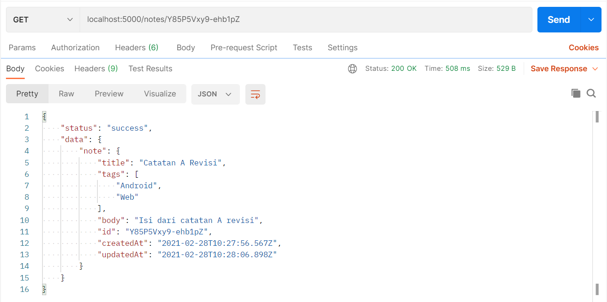
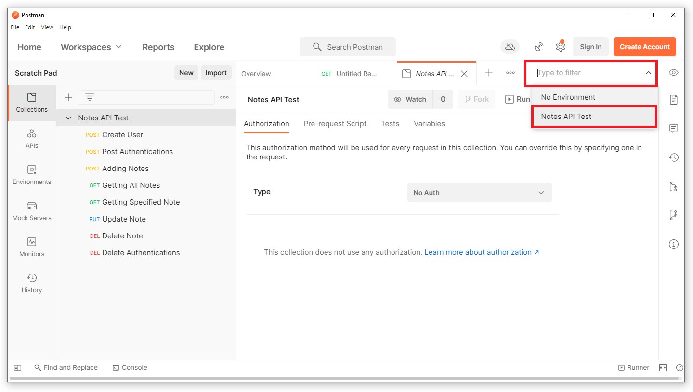

# Latihan: Menambah Catatan Baru

- Buka Postman
- Pilih metode POST
- Masukkan URL `http://localhost:5000/notes`
- Pilih tab Body
- Pilih raw
- Pilih JSON
- Masukkan data berikut:

```json
{
  "title": "Catatan A",
  "tags": ["Android", "Web"],
  "body": "Isi dari catatan A"
}
```

- Klik Send
- Periksa hasilnya

```javascript
{
  "status": "success",
  "message": "Catatan berhasil ditambahkan",
  "data": {
    "noteId": "zoo2qP_960poaEBH"
  }
}
```

# Latihan: Mendapatkan Seluruh Catatan yang Disimpan

- Buka request dengan tab baru
- Pilih metode GET
- Masukkan URL `http://localhost:5000/notes`
- Klik Send

Kita tidak perlu menambahkan data apapun karena kita hanya ingin mendapatkan data yang sudah ada.

Hasil:

```javascript
{
  "status": "success",
  "data": {
    "notes": [
      {
        "title": "Catatan A",
        "tags": [
          "Android",
          "Web"
        ],
        "body": "Isi dari catatan A",
        "id": "zoo2qP_960poaEBH",
        "createdAt": "2025-02-26T09:01:32.350Z",
        "updatedAt": "2025-02-26T09:01:32.350Z"
      }
    ]
  }
}
```

# Latihan: Mendapatkan Catatan Secara Spesifik

- Buka request dengan tab baru
- Pilih metode GET
- Masukkan URL `http://localhost:5000/notes/id`, ganti `id` dengan id catatan yang ingin diambil. Contohnya **"zoo2qP_960poaEBH"** yaitu id catatan yang didapat dari hasil sebelumnya.
- Klik Send

Hasil:

```javascript
{
  "status": "success",
  "data": {
    "note": {
      "title": "Catatan A",
      "tags": [
        "Android",
        "Web"
      ],
      "body": "Isi dari catatan A",
      "id": "zoo2qP_960poaEBH",
      "createdAt": "2025-02-26T09:01:32.350Z",
      "updatedAt": "2025-02-26T09:01:32.350Z"
    }
  }
}
```

Ketika id tidak ada atau url salah `http://localhost:5000/notes/123`

```javascript
{
  "status": "fail",
  "message": "Catatan tidak ditemukan"
}
```

# Latihan: Mengubah Catatan di Postman

- Buka request dengan tab baru
- Pilih metode PUT
- Masukkan URL `http://localhost:5000/notes/id`, ganti `id` dengan id catatan yang ingin diubah. Contohnya **"zoo2qP_960poaEBH"** yaitu id catatan yang didapat dari hasil sebelumnya.
- Pilih tab Body
- Pilih raw
- Pilih JSON
- Masukkan data berikut:

```json
{
  "title": "Catatan A",
  "tags": ["Android", "Web", "JavaScript"],
  "body": "Isi dari catatan A yang sudah diubah"
}
```

- Klik Send

Hasil:

```javascript
{
  "status": "success",
  "message": "Catatan berhasil diperbarui"
}
```

Hasil:



# Latihan: Menghapus Catatan di Postman

- Buka request dengan tab baru
- Pilih metode DELETE
- Masukkan URL `http://localhost:5000/notes/id`, ganti `id` dengan id catatan yang ingin dihapus. Contohnya **"zoo2qP_960poaEBH"** yaitu id catatan yang didapat dari hasil sebelumnya.
- Klik Send
- Periksa hasilnya
- Jika berhasil, hasilnya akan seperti ini:

```javascript
{
  "status": "success",
  "message": "Catatan berhasil dihapus"
}
```

Jika id tidak ada atau url salah `http://localhost:5000/notes/123`

```javascript
{
  "status": "fail",
  "message": "Catatan tidak ditemukan"
}
```

# Automate Testing Using Postman

Postman Anda juga bisa melakukan pengujian secara otomatis, sehingga tak perlu lagi melihat respons dari server secara manual untuk memastikan responnya sesuai dengan harapan. Pengujian otomatis di Postman menggunakan kode JavaScript, serupa dengan unit dan integration testing yang sudah Anda pelajari di kelas [Belajar Dasar Pemrograman JavaScript](https://www.dicoding.com/academies/256).

Testing ini bisa menguji status code, properti header, hingga body respons. Pengujian otomatis akan “pass” (berhasil) ketika semua variabel yang diuji sesuai ekspektasi. Bila ada salah satu yang tidak sesuai, maka pengujian akan “failed” (gagal).

Tapi, terlebih dahulu belajar collection dan environment di Postman.

# Postman Collection

Collection adalah storage untuk kumpulan request. Request yang kita kirim akan tersimpan di history sidebar. Anggap collection adalah folder.

Dengan collection kita bisa menjalankan seluruh request didalamnya secara bersamaan. Collection juga bisa diexport dan diimport.


# Postman Environment

Environment adalah tempat menyimpan variable. Variable ini bisa digunakan di request, collection, dan global.

Biasanya digunakan untuk nilai token, auth-key, id, dan lainnya yang sering berubah.

Tampilan environment di Postman:


Environment bisa digunakan di collection atau request yang spesifik.


Untuk melakukan request kita bisa menggunakan variable yang sudah kita buat di environment dengan menambahkan kurung kurawal `{{notesId}}`.

Notasi diatas bisa untuk mencoba di URL, parameter, header, body, dan lainnya.

Contoh:
`localhost:5000/notes/{{notesId}}`

# Skenario Pengujian Otomatis

- **Skenario 1: Adding Notes** (Memasukkan catatan baru)
- - Pastikan response memiliki status code 201.
- Pastikan header response `Content-Type` memiliki nilai `application/json`.
- Pastikan body response adalah object.
- Pastikan body response memiliki properti dan nilai yang sesuai.
- Pastikan data pada response body memiliki noteId dan nilainya tidak kosong.

- **Skenario 2: Getting All Notes** (Mendapatkan seluruh catatan)
- - Pastikan response memiliki status code 200.
- - Pastikan header response `Content-Type` memiliki nilai `application/json`.
- - Pastikan body response adalah `object`.
- - Pastikan body response memiliki properti dan nilai atau tipe data yang sesuai.
- - Pastikan data pada response body memiliki array `notes` dan terdapat minimal 1 item di dalamnya.

- **Skenario 3: Getting Specified Note** (Mendapatkan catatan secara spesifik)
- - Pastikan response memiliki status code 200.
- - Pastikan header response `Content-Type` memiliki nilai `application/json`.
- - Pastikan body response merupakan `object`.
- - Pastikan body response memiliki properti dan nilai atau tipe data yang sesuai.
- - Pastikan data pada response body memiliki properti note yang merupakan sebuah objek.
- - Pastikan objek `note` di dalam data memiliki properti `id`, `title`, `body`, dan `tags` dengan nilai yang sesuai.

- **Skenario 4: Update Note** (Memperbarui data catatan)
- - Pastikan response memiliki status code 200.
- - Pastikan header response `Content-Type` memiliki nilai `application/json`.
- - Pastikan body response adalah `object`.
- - Pastikan body response memiliki properti dan nilai yang sesuai.
- - Ketika mengakses catatan yang diperbaharui
- - Pastikan catatan yang diperbarui memiliki nilai terbaru.

- **Skenario 5: Delete Note**(Menghapus catatan)
- - Pastikan response memiliki status code 200.
- - Pastikan header response `Content-Type` memiliki nilai `application/json`.
- - Pastikan body response adalah `object`.
- - Pastikan body response memiliki properti dan nilai yang sesuai.
    Ketika mengakses catatan yang dihapus
- - Pastikan catatan yang dihapus tidak ditemukan.

# Latihan: Menambahkan Skenario Adding Notes
