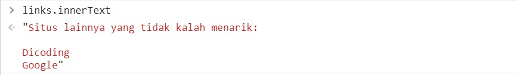
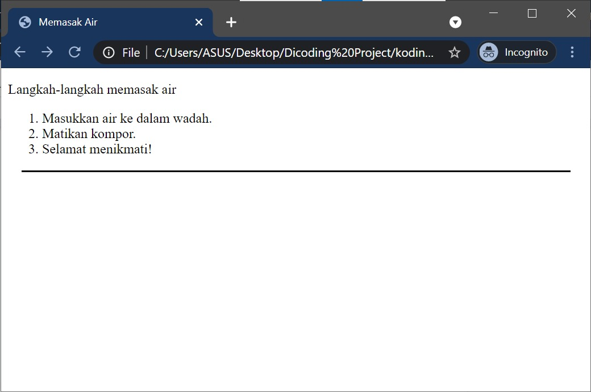

# Browser Object Model (BOM) dan Document Obejct Model (DOM)

Browser Object Model (BOM) dan Document Object Model (DOM). BOM dan DOM memiliki kemampuan mengubah laman web menjadi dinamis. Hal ini tidak dapat dicapai hanya dengan menggunakan HTML dan CSS saja.

## Cara JavaScript mengontrol BOM dan DOM

Dengan BOM ktia bisa menggunakan method `alert()` yang dimana akan menampilkan pesan pop-up pada browser, ada juga object `window` yang bisa digunakan untuk mengontrol browser, seperti mengarahkan

```javascript
window.alert('Welcome to Dicoding');
```

Kedua ada DOM. Mirip seperti BOM. Perbedaannya adalah kita menggunakan global object `document`. Dengan ini kita bisa mendapatkan elemen HTML dan bisa dimanipulasi. Biasanya dengan `getElementById()` atau `querySelector()`.

```javascript
document.getElementById('heading').innerHTML = 'Hello World';
```

## Menjalankan JavaScript di Website

Ada dua cara untuk memasukkan kode JavaScript ke dalam berkas HTML kita, yakni secara internal dan external.

Contohnya ketika meminta user input dari sebuah box yang muncul di browser, kita bisa menggunakan `prompt()`.

```javascript
const tamu = prompt('Siapakah Anda?');
alert('Selamat datang ' + tamu + '!');
```

Dan siapkan HTML dengan nama index.html

```html
<!DOCTYPE html>
<html>
  <body>
    <h2 id="pesan">Selamat datang!</h2>
  </body>
</html>
```

Kemudian kita bisa memanipulasi elemen tersebut dengan JavaScript.

### Internal Javascript

Cukup tuliskan kode Javascript ktia diantara tag pembuka dan penutup `<script>` dan `</script>`.

```html
<!DOCTYPE html>
<html>
  <head>
    <meta charset="UTF-8" />
  </head>
  <body>
    <h2 id="pesan">Selamat datang!</h2>

    <script>
      // Silakan aktifkan kode di bawah ini dengan hapus komentar untuk melihat hasilnya
      // const tamu = prompt('Siapakah Anda?');
      // alert('Selamat datang, ' + tamu + '!');
    </script>
  </body>
</html>
```

### External Javascript

Kita bisa membuat file JavaScript terpisah dengan ekstensi `.js`. Kemudian kita panggil file tersebut dengan menggunakan tag `<script>` dan menggunakan atribut `src`.

```html
<!DOCTYPE html>
<html>
  <head>
    <meta charset="UTF-8" />
  </head>
  <body>
    <h2 id="pesan">Selamat datang!</h2>

    <script src="script.js"></script>
  </body>
</html>
```

### Peletakkan Elemen Script Harus Tepat

Implementasi JavaScript di dalam HTML harus diletakkan di tempat yang tepat. Jika kita meletakkan script di atas elemen yang akan dimanipulasi, maka akan terjadi error.

Jika website tidak perlu JavaScript untuk menampilkan konten, maka sebaiknya kita letakkan script di akhir elemen body. Hal ini akan mempercepat proses rendering halaman. Dan jika diletakkan di awal, maka semua konten HTML tidak akan ditampilkan sebelum JavaScript selesai dijalankan.

```html
<!DOCTYPE html>
<html>
  <head>
    <script>
      alert('Silakan menekan OK di bawah untuk memunculkan isi halaman ini');
    </script>
  </head>
  <body>
    <h2 id="pesan">Selamat datang!</h2>
  </body>
</html>
```

Pada script diatas user harus menekan OK terlebih dahulu sebelum konten HTML ditampilkan. Sebaiknya kita letakkan script di akhir elemen body.

```html
<!DOCTYPE html>
<html>
  <head> </head>
  <body>
    <h2 id="pesan">Selamat datang!</h2>

    <script>
      alert('Silakan menekan OK di bawah untuk memunculkan isi halaman ini');
    </script>
  </body>
</html>
```

## Browser Environment

Awalnya JavaScript hanya digunakan di browser. Namun, saat ini JavaScript bisa dijalankan dengan runtime environment seperti NodeJS atau glot.io.

Namun, di beberapa kasus, kita perlu menyesuaikan kode JavaScript kita dengan environment yang berbeda. Misalnya, saat kita ingin menampilkan pesan pop-up di browser, kita menggunakan `alert()`. Namun, di NodeJS, kita tidak bisa menggunakan `alert()`.

Berikut adalah representasi objek `window` di browser.


Dan jika kita memaksa menjalankan kode JavaScript yang berjalan di luar Browser, maka akan terjadi error.

## Pendahuluan Browser Object Model (BOM)

Objek window punya 3 method paling dasar yaitu `alert()`, `console()`, dan `prompt()`. Ketiganya digunakan untuk menampilkan pesan pop-up di browser.

## Anggota BOM: Method alert

### Method alert

Method `alert()` digunakan untuk menampilkan pesan pop-up di browser. Method ini hanya menerima satu parameter, yakni pesan yang akan ditampilkan.

```javascript
window.alert('Hello World');
```

Atau

```javascript
let message = 'Halo, user!';
alert(message);
```

## Anggota BOM: Method prompt

Untuk mengambil input dari user, kita bisa menggunakan method `prompt()`.

### Nilai Kembalian Method prompt

Sebenarnya method `alert()` akan mengembalikan value undefined. Namun, `prompt()` akan mengembalikan nilai yang diinput oleh user.

```javascript
let pesanInput = prompt('Masukkan pesan:');
```

Terlihat bahwa `pesanInput` sesuai dengan input yang dimasukkan oleh user. Dan jika user hanya menekan tombol OK tanpa menginputkan apapun, maka nilai yang dikembalikan adalah string kosong. Dan jika menekan tombol Cancel, maka nilai yang dikembalikan adalah null.

Dan ketika kita input angka pada prompt, maka nilai yang dikembalikan adalah string.

```javascript
let pesanInput = prompt('Silakan masukkan angka...');
console.log(`Tipe data dari \`pesanInput\` adalah ${typeof pesanInput}`);
```

Akan tetapi kita bisa melakukan _cast_ atau _parse_ untuk mengubah tipe data dari string ke number. Namun, jika input yang dimasukkan bukan angka, maka akan menghasilkan `NaN`.

```javascript
let pesanInput = prompt('Silakan masukkan angka yang Anda suka!');
let pesanInputConvertedToNumber = Number(pesanInput);
console.log(`Tipe data dari \`pesanInputConvertedToNumber\` adalah ${typeof pesanInputConvertedToNumber}`);
```

## Memberikan Nilai Default pada Method prompt

Kita bisa memberikan nilai default pada method `prompt()` dengan memberikan parameter kedua.

```javascript
let name = prompt('Silakan masukkan nama Anda!', 'John Doe');
console.log(name);
```

Dan ketika dialog box dari `prompt()` muncul, kita tidak bisa berinteraksi dengan komponen lain pada halaman web sampai kita menekan tombol OK atau Cancel. Hal ini sama seperti `alert()`.

## Anggota BOM: console

`console` biasanya digunakan untuk debugging. Kita bisa menampilkan pesan di console browser dengan menggunakan method `log()`.

```javascript
console.log('Hello World');
```

Beberapa method dari objek `console` adalah:

| Method    | Penjelasan                                                                          |
| --------- | ----------------------------------------------------------------------------------- |
| `log()`   | Menampilkan pesan secara umum ke console browser.                                   |
| `error()` | MMenampilkan pesan yang berisi informasi penting ke console browser.                |
| `warn()`  | Menampilkan pesan yang berisi informasi dalam bentuk peringatan ke console browser. |
| `info()`  | Menampilkan pesan yang berisi informasi dalam bentuk error ke console browser.      |

```javascript
// Silakan aktifkan kode di bawah ini dengan hapus komentar untuk melihat hasilnya
// console.log('Ini adalah console log');
// console.info('Ini adalah console info');
// console.warn('Ini adalah console warn');
// console.error('Ini adalah console error');
```

## Cara Memanggil Anggota BOM

```javascript
// Cara pertama
window.alert('Hello World');

// Cara kedua
alert('Hello World');
```

Kedua cara di atas sama-sama benar. Karena `window` adalah global object di JavaScript, maka kita bisa menghilangkannya.

Namun, hati hati jika ada scope sebuah berkas .js terdapat nama fungsi yang sama maka pesan pada pop-up tidak akan muncul.

```javascript
function alert(nama) {
  console.log('Hati-hati, ' + nama);
}

alert('Chewbacca'); // Output: Hati-hati, Chewbacca
// Output di atas akan tercetak ke console browser

window.alert('Chewbacca'); // Output: Hati-hati, Chewbacca
// Output di atas akan tetap tercetak pada console browser
```

> Catatan: Code diatas akan memunculkan window.alert(). Padahal, seharusnya tidak ada alert karena tergantikan oleh fungsi alert() yang kita buat.

## Pendahuluan Document Object Model (DOM)

DOM memberikan izin bagi kode JavaScript untuk mengakses elemen HTML dan mengubahnya. DOM adalah representasi dari struktur HTML yang bisa diakses dan dimanipulasi oleh JavaScript.

Jika BOM diwakilkan oleh objek `window`, maka DOM diwakilkan oleh objek `document`.

## DOM Tree

DOM Tree adalah representasi dari struktur HTML yang bisa diakses dan dimanipulasi oleh JavaScript. DOM Tree terdiri dari elemen-elemen HTML yang disusun secara hirarkis.

Di HTML, batang induk dari DOM Tree adalah elemen `<html>`. Di bawahnya ada elemen `<head>` dan `<body>`. Di bawah elemen `<body>` ada elemen-elemen lain seperti `<h1>`, `<p>`, `<div>`, dan lain-lain.

```html
<!DOCTYPE html>
<html>
  <head>
    <title>DOM Tree</title>
  </head>
  <body>
    <h1>Hello Developer Front-End Web!</h1>
    <p>Belajar Membuat Front-End Web untuk Pemula</p>
  </body>
</html>
```

Kurang lebih struktur DOM Tree dari kode di atas adalah sebagai berikut:


## Mencari DOM (Mendapatkan DOM)

Untuk mengakses elemen kita gunakan **document**. Objek ini berisi seluruh elemen HTML yang ada di halaman web.

```javascript
document; // objek document
document.body; // elemen body
document.head; // elemen head
document.title; // elemen title
```

Lebih specific lagi kita bisa menggunakan `getElementById()` atau `querySelector()`.

```javascript
document.getElementById('heading'); // elemen dengan id heading
document.querySelector('h1'); // elemen h1 pertama
```

| Method                   | Contoh                                        | Fungsi                                                                                            |
| ------------------------ | --------------------------------------------- | ------------------------------------------------------------------------------------------------- |
| getElementById()         | document.getElementById('display');           | Mengembalikan satu elemen yang memiliki nilai id "display".                                       |
| getElementsByName()      | document.getElementsByName('button');         | Mengembalikan banyak elemen (HTMLCollection) yang memiliki attribute name dengan nilai "button".. |
| getElementsByTagName()   | document.getElementsByTagName('p');           | Mengembalikan banyak elemen (HTMLCollection) yang memiliki tag `<p>`.                             |
| getElementsByClassName() | document.getElementsByClassName('container'); | Mengembalikan banyak elemen (HTMLCollection) yang memiliki class "container".                     |
| querySelector()          | document.querySelector('h1');                 | Mengembalikan satu elemen yang pertama ditemukan dengan tag `<h1>`.                               |
| querySelectorAll()       | document.querySelectorAll('p');               | Mengembalikan banyak elemen (NodeList) yang memiliki tag `<p>`.                                   |

Method diatas ada yang mengembalikan HTMLCollection dan NodeList. Karena method diatas dimiliki oleh objek document, maka pemanggilannya harus diawali dengan document.

Pada method `querySelectorAll(.button)` kita akan mendapatkan NodeList. Dan NodeList ini mirip seperti array, namun tidak memiliki method `map()`, `filter()`, dan `reduce()`. Namun kita bisa menggunakan property `length` dan method `forEach()`.

```javascript
const buttons = document.querySelectorAll('.button');
console.log(buttons.length); // Output: 3

for (let item of buttons) {
  console.log(item);
}
```

Untuk mendapatkan elemen HTML berdasarkan class kita menggunakan tanda titik `.`, sedangkan untuk mendapatkan elemen HTML berdasarkan id kita menggunakan tanda pagar `#`.

## Membuat Elemen HTML

Dengan DOM kita mampu membuat konten HTML menggunakan method `createElement()`, Contohnya jika kita ingin membuat sebuah elemen HTML dengan tag `p`.

```javascript
const newElement = document.createElement('p');
```

Dan jika kita ingin menambahkan teks ke dalam elemen HTML kita bisa menggunakan `innerText`.

```javascript
newElement.innerText = 'Selamat datang ke HTML kosong ini :)';
```

Contohnya kita ingin menambahkan tag `<b>` ke dalam elemen HTML. menggunakan `innerHTML`.

```javascript
newElement.innerHTML = '<b>Selamat datang</b> ke HTML kosong ini :)';
```

Kita juga bisa menambahkan elemen gambar ke dalam elemen HTML.

```javascript
const newImage = document.createElement('img');
```

Dan untuk mengatur atribut dari elemen HTML kita bisa menggunakan `setAttribute()`.

```javascript
newImage.setAttribute('src', 'https://picsum.photos/200/300');
```

Dan dari keseluruhan kode diatas elemen HTML tidak muncul ketika kita membuatnya. Karena elemen elemen tersebut belum kita sematkan ke dalam elemen HTML yang sudah ada.

## Mengubah Konten HTML - Menyiapkan Konten

Siapkan elemen HTML yang akan kita manipulasi.

```html
<!DOCTYPE html>
<html>
  <head>
    <title>Welcome to Cube World!</title>
    <style>
      button {
        width: 200px;
        font-size: 15px;
        margin: 8px;
        padding: 3px;
      }
    </style>
  </head>
  <body>
    <div align="center">
      <h2>Its Cube Time!</h2>
      
      <p id="caption"><b>Sudah siap untuk memecahkan teka-teki permainan tersebut?</b></p>
      <div class="button-group">
        <div class="button">
          <button>Sejarah</button>
        </div>
        <div class="button">
          <button>Permainan</button>
        </div>
        <div class="button">
          <button><i>Fun Fact</i></button>
        </div>
        <div class="button">
          <button>Play (Coming Soon)</button>
        </div>
        <div class="button">
          <button>Exit</button>
        </div>
      </div>
    </div>
  </body>
</html>
```

> Pada tag `<div>` terdapat atribut dengan nilai center yang berfungsi untuk memosisikan seluruh child element berada di tengah-tengah parent element-nya. Namun, penggunaan atribut ini sudah usang (deprecated) sehingga penggunaannya sudah tidak di rekomendasikan kembali. Solusinya adalah menuliskan aturan styling menggunakan CSS.

## Memanipulasi Atribut Melalui setAttribute()

Method yang digunakan untuknya adalah `setAttribut()` yang dipanggil dari elemen yang telah kita dapatkan sebelumnya.

```javascript
element.setAttribute('nama_atribut_sasaran', 'nilai_atribut_sasaran');
```

Ada beberapa hal yang bisa kta ubah pada elemen HTML, seperti:

- Menyesuaikan ukuran gambar yang terlalu kecil.
- Menonaktifkan button ke-4 (Play (Coming Soon)).

Jika ingin memperbesar gambar kita bisa mengubah nilai dari atribut width dan height.

```javascript
const gambar = document.getElementById('gambar');
```

Selanjutnya kita akses variabel gambar dan ubah nilai dari atribut width dan height. Masing masing "300" dan "215".

```javascript
gambar.setAttribute('width', 300);
gambar.setAttribute('height', 215);
```

Dan berikutnya kita akan mengubah tombol yang memiliki caption "Play (Coming Soon)".

Kita tidak bisa mengakses nya dengan `getElementById()` karena elemen ini tidak memiliki ateibut id yang unik. Jadi kita bisa menggunakan `querySelectorAll()`.

```javascript
const buttons = document.querySelectorAll('.button');
```

Jika hanya menggunakan `querySelectorAll()` maka kita akan mendapatkan NodeList. Untuk mendapatkan elemen HTML kita bisa menggunakan index.

```javascript
const playButton = buttons[3];
```

Hasil yang ktia dapatkan masih berupa elemen `<div>` yang berisi elemen `<button>`. Jadi kita harus mengakses elemen `<button>` nya dengan menggunakan property `children`. Dan karena elemen tersebut hanya punya satu child element, maka kita bisa mengaksesnya dengan index 0.

```javascript
const playButtonElement = playButton.children[0];
```

Kemudian kita bisa mengubah atribut nya dengan menggunakan `setAttribute()`.

```javascript
playButtonElement.setAttribute('type', 'submit');
```

Dan sekarang tombol tersebut sudah menjadi tombol submit.

### Javascript Automatic Type Conversion pada setAttribute()

Pada method `setAttribute()` JavaScript akan melakukan konversi tipe data secara otomatis. Sehingga kita tidak perlu melakukan konversi tipe data secara manual.

```javascript
gambar.setAttribute('width', '300');
gambar.setAttribute('height', '215');
```

akan memberikan hasil yang sama dengan:

```javascript
gambar.setAttribute('width', 300);
gambar.setAttribute('height', 215);
```

Hal ini terjadi karena JavaScript memiliki fitur _automatic type conversion_.

## Memanipulasi Konten Mlelaui ineerText, innerHTML, dan style.property

### Perbedaan innerText dan innerHTML

Pertama kita buat variabel baru untuk menampung elemen HTML yang akan kita manipulasi.

```javascript
const links = document.getElementById('links');
```

Kemudian jika kita panggil `innerHTML`, maka outputnya:


Sedaangkan jika kita panggil `innerText`, maka outputnya:



Jadi, ketika kita menggunakan `innerHTML` maka akan mengambil semua konten dalam sebuah elemen beserta tag-tag HTML nya. Sedangkan `innerText` hanya akan mengambil teks saja tanpa tag-tag HTML yang ada.

### Manipulasi Konten dengan innerText

Kita bisa mengubah konten dari elemen HTML dengan menggunakan `innerText`.

```javascript
links.innerText = 'Belajar Programming di Dicoding';
```

Kita akan ubah teks "Dicoding" menjadi "Belajar Programming di Dicoding". Pertama, kita akan mengambil elemen id-nya "dicodingLink" dan "googleLink".

```javascript
const dicoding = document.getElementById('dicodingLink');
dicoding.innerText = 'Belajar Programming di Dicoding';

const google = document.getElementById('googleLink');
```

### Manipulasi Konten dengan innerHTML

Kita akan mengubah konten dari elemen HTML dengan menggunakan `innerHTML`. Di sini kita akan mengubah konten HTML dengan menambahkan tag `<i>`. Karena sebelumnya kita sudah menyimpan elemen dengan id "dicodingLink" ke dalam variabel `dicoding`.

```javascript
dicoding.innerHTML = '<i>Belajar Programming di Dicoding</i>';
```

Jadi, Jika kita melakukan assignment dengan string `"<i>Belajar Programming Dicoding</i>"` menggunakan `innerText`, maka teks akan muncul beserta tag HTML-nya. Sedangkan jika menggunakan `innerHTML` akan menjadi seperti berikut.


### Manipulasi Konten dengan style.propertySekar

Sekarang kita akan membuat tombol tombol yang ada menjadi memiliki ujung yang melengkung. Pada kasus ini, kita ingin menambahkan style berupa border-radius dengan nilai "4px" dari semua button di atas.

Kita tidak akan menggunakan `querySelectorAll()` dan kita akan menggunakan `getElementsByClassName()`.

```javascript
const buttons = document.getElementsByClassName('button');
```

Karena kita tidak menggunakan `querySelector` dan `querySelectorAll()` maka kita tidak perlu menuliskan selector nya. Dan untuk mendapatkan elemen HTML nya kita gunakan `children` yang mengembalikan HTMLCollection. Dan untuk mengakses elemen HTML nya kita gunakan index.

```javascript
for (const button of buttons) {
  console.log(button.children[0]);
}
```

Setelah mendapatkan elemen yang dituju (button, kita bisa mengakses memnaggil objek `style` dan property `borderRadius`.

```javascript
for (const button of buttons) {
  button.children[0].style.borderRadius = '6px';
}
```

Styling yang kita ingin ubah pada asalnya adalah `border-radius: 6px;`. Namun, karena nama properti dari objek DOM mengikuti standar penamaan variabel khusus. Penamaan properti CSS yang menggunakan tanda `-` (dash) akan diubah menjadi camelCase. Sehingga `border-radius` menjadi `borderRadius`.

## Menambahkan Elemen HTML ke DOM

Di materi ini kita akan belajar mengenaia 2 method yaitu `appendChild()` dan `insertBefore()`.

Buat struktur HTML sederhana.

```html
<!DOCTYPE html>
<html>
  <head>
    <title>Memasak Air</title>
  </head>
  <body>
    <p id="name">Langkah-langkah memasak air</p>
    <ol id="daftar">
      <li id="awal">Masukkan air ke dalam wadah.</li>
      <li id="akhir">Matikan kompor.</li>
    </ol>
    <hr size="2" width="95%" color="black" />
  </body>
</html>
```

> Catatan:
> Pada tag `<hr>` terdapat atribut size, width, dan color. Atribut ini sudah usang (deprecated) dan tidak direkomendasikan lagi. Solusinya adalah menuliskan aturan styling menggunakan CSS.

Dan ini hasilnya:


### Menambahkan Elemen HTML dengan appendChild()

`appendChild` berfungsi untuk menambahkan atau menyisipkan sebuah child elemen ke bagian akhir dari sebuah elemen parent.

Kita ingin menambahkan langkah baru yakni sebuah pesan berisi "Selamat penikmati".

Sebelum kita memanggil elemen `<ol>`, kita kaan membaut sebuah elemen baru terlebih dahulu dengan method `createElement()`. Elemen yang kita ingin buat adalah `<li>`

```javascript
const newElement = document.createElement('li');
```

Selanjutnya kita akan masukkan konten teks "Selamat menikmati!" ke dalam `<li>` dengan menggunakan `innerText`.

```javascript
newElement.innerText = 'Selamat menikmati!';
```

Langkah selanjutnya kita akan mendapatkan parent elemen yakni elemen `<ol>`.

```javascript
const daftar = document.getElementById('daftar');
```

Dan ini jika kita lihat di browser:


Saat ini belum ada perubahan di layout HTML nya karena kita belum menambahkan elemen baru ke dalam elemen `<ol>`. Untuk menambahkan elemen baru ke dalam elemen `<ol>` kita bisa menggunakan method `appendChild()`.

```javascript
daftar.appendChild(newElement);
```

### Menambahkan Elemen HTML dengan insertBefore()

Method `insertBefore()` memberikan kemampuan untuk menyisipkan elemen sebelum child elemen tertentu dalam parent element. Method ini menerima dua parameter, yakni (1) elemen yang akan disisipkan dan (2) child elemen yang akan dijadikan acuan.



Dari gambar diatas terdapat keanehan pada langkah ke-2. Kita akan memperbaiki langkah ke-2 dengan menambahkan langkah baru yakni "Hidupkan kompor".

Pertama kita akan membuat elemen baru dengan method `createElement()`.

```javascript
const elementAwal = document.createElement('li');
```

Selanjutnya tuliskan pesan "Hidupkan kompor." ke dalam elemen baru tersebut.

```javascript
elementAwal.innerText = 'Hidupkan kompor.';
```

Langkah ketiga adalah mendapatkan parent elemen dari semua elemen `<li>` yaitu elemen `<ol>`. Namun, kita sudah mendeklarasi dan mengisialisasi variabel `daftar` sebelumnya.

Di elemen `<ol>`, terlihat bahwa child element pertama punya atribut id dengan nilai "awal". Untuk memasukkan elmen baru di posisi awal kita butuh elemen yang punya atribut id "awal".

```javascript
const itemAwal = document.getElementById('awal');
```

Langkah terakhir adalah memanggil method `insertBefore()` pada variabel daftar.

```javascript
daftar.insertBefore(elementAwal, itemAwal);
```

## Rangkuman Browser Object Model (BOM) dan Document Object Model (DOM)

Selamat! Anda sudah berada di penghujung materi Browser Object Model & Document Object Model. Sudah banyak materi yang Anda lewati dan pelajari. Mari kita uraikan seluruh materi yang sudah dipelajari untuk memperkuat ingatan.

- Browser Object Model (BOM):
  - Objek JavaScript yang tersedia di browser yang dapat digunakan untuk mengontrol browser.
- Member dari BOM yang sering digunakan:
  - alert: Menampilkan pop-up pesan pada browser.
  - prompt: Menampilkan pop-up pesan yang dapat menerima input dari pengguna.
  - console: Menampilkan pesan atau nilai pada console browser.
- Document Object Model (DOM):
  - Objek JavaScript yang tersedia di browser yang dapat digunakan untuk mengontrol dan memanipulasi konten yang ditampilkan pada website.
- DOM Tree:
  - Struktur Website dalam bentuk JavaScript objek yang terbentuk seperti bagan pohon.
  - DOM Tree terbentuk berdasarkan dari struktur berkas HTML.
- Teknik manipulasi DOM:
  - Mendapatkan Elemen: document.querySelector, document.querySelectorAll, document.getElementById, dan sebagainya.
  - Membuat Elemen: document.createElement.
    Mengubah Konten: element.innerHTML, element.innerText, element.setAttribute(), dan sebagainya.
  - Menambahkan Element: element.appendChild.
